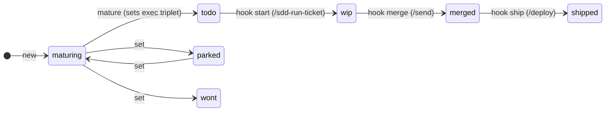

# backlog-as-data

**A spec-driven backlog and agent-orchestration system for Claude Code, where the
backlog is git data — not a document.**

> **What this is (and is not).** This repo is the extraction of a personal system
> that runs daily on real projects. It is published as a **reference
> implementation** — read it, steal ideas from it, adapt pieces of it. It is
> **not a supported product**: no installer, no roadmap, no issue triage promised.
> The README explains every concept in English; the CLI source and the skill
> prompts are published verbatim from the working system (skills translated to
> English, code comments still in French — the design rationale they carry is
> covered below).

---

## TL;DR

Most agent task-management tools store tasks in a dedicated place (a `tasks.json`,
a database, a `backlog/` folder). This system makes a different bet:

**The backlog *is* the YAML frontmatter of your spec files.** One file per ticket
in `specs/`, `type: ticket` in the frontmatter, and the ticket's status is a
**field** — never a location in a document. Everything else (`backlog.json` for a
web board, `specs/backlog.md` for humans reading git) is a generated projection,
locked by a sentinel and regenerated by every mutation.

On top of that data model sit four ideas that, as far as we can tell, no
published tool combines (see [Comparison](#comparison-with-existing-tools)):

1. **[Maturation with a per-ticket execution triplet](#2-maturation-dosing-model--effort--review-per-ticket)** —
   deciding to do a ticket and deciding *how hard to think about it* are separate
   acts. Maturing a ticket means fixing `model` / `effort` / `review` **before**
   any agent runs.
2. **[Lifecycle hooks tied to the git flow](#3-lifecycle-hooks-tied-to-the-git-flow)** —
   `todo → wip → merged → shipped` is applied by hooks attached to the run /
   integrate / deploy commands, keyed on conventional commits
   (`feat(TICKET-ID): …`). No human, and no agent, ever sets the back half of the
   lifecycle by hand.
3. **[A review gate held by the orchestrator, with fresh-context reviewers](#4-the-review-gate-fresh-context-reviewers-orchestrator-held-evidence)** —
   the implementing agent never spawns, briefs, or even knows about its
   reviewers. The evidence of review (reviewer count, `git status`, the review
   register) is produced by the orchestrator, never by the entity it audits.
4. **[Commitment and lifecycle as orthogonal axes](#the-state-model-two-orthogonal-axes)** —
   MoSCoW priority answers "did we choose to do this?"; the lifecycle answers
   "where is it in the pipeline?". Conflating them is the most common failure
   mode we saw in LLM-managed backlogs.

## Why

This came out of running Claude Code daily on a solo project with many parallel
agent sessions. Markdown to-do documents kept failing in the same ways:

- **"Move it to Done" is not an operation** — LLMs (and humans) mangle documents
  when a state change means relocating text. Making status a field makes every
  transition a one-line, idempotent, testable mutation.
- **Two sources of truth always diverge.** If the board and the specs are edited
  independently, they drift. Here the specs' frontmatter is canonical; the board
  and the readable view are projections with a coherence test (regenerate, then
  fail if git sees a diff).
- **Parallel agents stomp on shared documents.** With one file per ticket and
  hooks that commit only the files they actually touched, parallel sessions
  stopped colliding on the backlog.
- **A backlog managed *by* agents needs machine-checkable invariants**, not
  conventions. The invariants live in a Zod schema and a hand-rolled, bounded
  YAML-subset parser (round-trip-safe, CRLF-tolerant), enforced by every CLI
  entry point.

## The data model

A ticket is a markdown file in `specs/` whose frontmatter carries the state:

```markdown
---
id: ANALYTICS-02
title: Batch-compute cast rates when null
type: ticket
status: todo
priority: should
epic: analytics
exec:
  model: sonnet
  effort: think-hard
  review: light
  matured: 2026-06-12
---

# ANALYTICS-02 — Batch-compute cast rates when null

The spec body. Design, contracts, test cases. The ticket file IS the spec —
or points to a domain spec that is.
```

Everything below the frontmatter is the spec: free prose, owned by whoever
writes specs. The frontmatter is data: owned by the CLI, mutated only through
it. That split is the whole trick — spec-writing stays a writing activity,
backlog management becomes data manipulation, and they live in the same file so
they can never drift apart.

Mutations go through a CLI (bundled to a single self-contained `.mjs`, installed
once in `~/.claude/tools/backlog/`, operating on whatever project `cwd` is in).
Note that the CLI is **agent-facing**: in practice the human never types these
commands — they state intents in conversation, and the agent maps them to
exactly one CLI verb (see [How a ticket flows](#how-a-ticket-flows-end-to-end)):

```
backlog new ANALYTICS-02 --epic analytics --priority should   # creates in `maturing`
backlog mature ANALYTICS-02 --model sonnet --effort think-hard --review light --date 2026-06-12
backlog set ANALYTICS-02 status=parked                         # explicit correction only
backlog snapshot                                               # regenerate projections
backlog list                                                   # terminal view, no web board needed
backlog init                                                   # adopt on any project: .gitattributes + empty backlog.json + specs/
```

Every mutation regenerates **both** projections in the same gesture:
`backlog.json` (consumed by an admin board) and `specs/backlog.md` (readable in
git). The generated view opens with a sentinel comment — `DO NOT EDIT BY HAND` —
and the renderer **refuses to overwrite a file that lacks the sentinel**, so a
legacy hand-written backlog restored by a bad merge can never be silently
clobbered, and a hand-edit is flagged instead of being overwritten in silence.

### The state model: two orthogonal axes



- **Axis 1 — Commitment**: `priority: must|should|could` (we chose to do it) ·
  `status: parked` (still deciding) · `status: wont` (decided against).
- **Axis 2 — Lifecycle**: `maturing → todo → wip → merged → shipped`.

The two axes are orthogonal, and the distinction that LLMs get wrong most often
is: **"not yet matured" ≠ "parked"**. A ticket you *know* you want but haven't
sized yet is `maturing` + a priority — not `parked`. We saw this conflation
repeatedly before making it an explicit rule.

The invariant tying the axes together: the `exec` block is **required** for
`todo/wip/merged`, **optional** for `shipped` (historical tickets migrated
without traced maturation), **forbidden** otherwise. Setting a matured ticket
back to `parked` removes `exec` automatically ("dematuration") — otherwise `set`
would be a dead end for matured tickets.

## The four ideas in detail

### 1. The backlog is git data

Covered above, but three design points are worth stealing on their own:

- **Status is a field, never a location.** There is no "Done section". The
  readable view groups by status, but it's generated — nobody edits it.
- **Projections are locked and tested.** A coherence test regenerates the
  snapshot and fails if git sees a diff. Stale projections can't survive a
  `/send` (integration) because the test runs in its guard step.
- **The parser is deliberately tiny.** A bounded YAML subset: top-level scalars,
  one nesting level (the `exec:` block), comma-separated scalars for lists, no
  multi-line values — free text belongs in the body, never the frontmatter.
  Small enough to be round-trip-safe and CRLF-proof, which is what lets the
  serializer rewrite files without ever mangling a spec.

### 2. Maturation: dosing model / effort / review per ticket

`backlog mature` is the moment a ticket becomes runnable, and it forces three
decisions *as data*:

| Field | Values | What it doses |
|---|---|---|
| `model` | `fable` · `opus` · `sonnet` · `haiku` | Which model implements the ticket |
| `effort` | `none` · `think` · `think-hard` · `ultrathink` | Reasoning depth, injected into the implementer's prompt |
| `review` | `none` · `light` · `deep` | The review gate: 0, 1, or 3 fresh-context reviewers |

Why this matters: agent runs have a per-ticket cost/quality trade-off, and the
right place to decide it is **at planning time, deliberately** — not at launch
time, implicitly, by whoever happens to type the command. A trivial rename gets
`haiku / none / none`. An irreversible data migration gets
`fable / ultrathink / deep`. The decision is versioned with the ticket and
auditable after the fact (`matured: <date>`).

Two hard-won rules ride along:

- **`review` absent = `light`, and the default lives in the consumer** — the
  runner applies it; the CLI never writes a default into the frontmatter. Data
  records decisions; defaults are behavior.
- **We rejected a mandatory `--review-why` justification.** Asking a model to
  justify its dosing produces post-hoc rationalization, not deliberation. On a
  real ticket, the maturing agent chose `deep` and was right, while a
  second opinion argued `light` and was wrong — a written justification would
  not have distinguished them. Criterion that actually works: *if this defect
  slipped through, would anything else catch it?* No test would catch it, or
  publicly visible → `deep`. Will explode on next use anyway → `light`.

### 3. Lifecycle hooks tied to the git flow

The back half of the lifecycle (`wip → merged → shipped`) is **never set by
hand**. Three workflow commands each fire a hook:

| Command | Hook | Transition |
|---|---|---|
| `/sdd-run-ticket X` (launch an implementer) | `hook start X` | `todo → wip`, for that id only |
| `/send` (rebase + fast-forward into main) | `hook merge` | every `wip` whose `feat(ID):`/`fix(ID):` commit is **actually on the integration branch** → `merged` |
| `/deploy` (verify + push to prod) | `hook ship` | every `merged` → `shipped` (a deploy pushes all of main) |

Design decisions that took incidents to learn:

- **`merge` promotes only tickets whose implementation commit is on the
  branch** — read from commit *subjects*, only `feat(...)`/`fix(...)`
  conventional scopes. Body mentions and `chore(backlog): start X` commits used
  to cause premature promotions.
- **Hooks always exit 0.** A project without a backlog, an unknown event, a
  failed transition — all warnings, never failures. Lifecycle automation must
  never block integration or deployment.
- **Hook commits are surgical.** The main checkout is shared by many parallel
  sessions. `git add specs/` would sweep up a neighbor session's in-progress
  ticket (this happened — 2026-07-17). Hooks commit **only the files of tickets
  they actually transitioned**, with `git commit --only -- <paths>`.
- **Chained hooks mean a ticket coded outside the pipeline stays `todo`** — the
  merge hook only promotes `wip`. That's a feature: the manual `set` correction
  is legitimate then, and visible as such.

### 4. The review gate: fresh-context reviewers, orchestrator-held evidence

`/sdd-run-ticket` runs the full loop for one ticket: preflight guards →
implementer sub-agent in an isolated git worktree → review gate → findings sent
back → integration. The gate design is the part we haven't seen elsewhere:

- **Reviewers arrive with a blank context.** They get the ticket id, the spec
  path, the worktree path, the commit SHA, and four review axes — *nothing
  else*. No summary of what the implementer did, no justification of choices, no
  hints of where to look. Contaminating the reviewer's context is the main
  vector for confirmation bias, so the reviewer prompt is a frozen template
  where only mechanical values are substituted.
- **The orchestrator, not the implementer, holds the evidence.** The implementer
  never knows the review dosage, never sees the reviewer prompt, and cannot
  attest to anything about the review. The orchestrator constates `git status
  --porcelain` before and after the review (reviewers keep write tools
  technically — the read-only rule is declarative, so the check is the real
  guarantee), reads the SHA programmatically (a hand-transcribed SHA once
  arrived with 39 characters and broke the reviewer's location assertion), and
  publishes a **review register**: findings in, dispositions out, one line per
  unique finding, with a mechanical completeness check.
- **Findings have exactly two exits: fixed, or escalated with justification.**
  The implementer triages every finding into fix, or one of three closed
  escapes — E1 (fix requires changing the spec), E2 (pre-existing debt → open a
  ticket via the CLI), E3 (fix breaks an existing green test). No silent
  dismissal: "not a big deal" is not a disposition. E2 has its own trap,
  documented after a real miss: pre-existing-ness is tested on *"would the
  defect exist if my ticket had never shipped?"*, never on *"is the file inside
  my diff?"* — stale docs about your new flag are in scope even though the doc
  file is old.
- **Reviewers report findings-only, no praise.** A report that says "everything
  else conforms" manufactures false confidence — it once accompanied a report
  that declared conformant the very decisions it was missing a defect in. And
  "0 findings + remarks in prose" is a contradiction: an off-format remark *is*
  a finding someone filtered.
- **One round.** After dispositions, no second wave of reviewers. Review gates
  that loop become polishing loops.

Dosage recap: `none` — no gate; `light` (default) — 1 reviewer, all four axes;
`deep` — 3 reviewers in parallel, each with **all four axes** plus a different
priority lens. Axes are never partitioned: on a real `deep` run, no reviewer
stayed in its lane and the most lane-disciplined reviewer found the *least*.
`deep` buys three decorrelated samples of the same diff, not three complementary
coverages.

## How a ticket flows (end to end)

The division of labor matters: **the human never runs the CLI, never writes
frontmatter, and never edits the spec files directly**. You steer in
conversation; the agent does all the mechanics through the CLI (that is what
makes the mutations deterministic — the agent has no hand-editing path). A
typical cycle, as it actually happens:

```
you        open a conversation on a fresh worktree:
           "we should handle X" — one ticket, or an epic to slice
you+agent  discussion until the need is agreed — requirements elicitation
           happens in chat, not in the spec file
agent      once agreed, records it:
             backlog new PARSE-07 --priority should      # status: maturing
           and writes the spec body (design, contracts, test list)
           from the conversation
you        "mature it, then run it"
agent      backlog mature PARSE-07 --model sonnet --effort think \
             --review light --date 2026-07-22            # status: todo
           (the triplet is a maturation decision — the agent asks you
           for the review dosage rather than choosing in your place)
agent      /sdd-run-ticket PARSE-07
  hook       start → wip  (committed on main, scoped to this ticket's files)
  subagent   implementer sub-agent spawned in an isolated worktree forked
             from main, with the model/effort from the frontmatter; SDD
             discipline: spec → failing tests → code → green verification →
             ONE commit `feat(PARSE-07): …` → report, then STOPS
             (never integrates itself)
  gate       the agent (as orchestrator) locates worktree+SHA
             programmatically, spawns 1 fresh reviewer sub-agent (light),
             collects findings, checks git status unchanged, sends raw
             findings back, implementer triages/fixes, orchestrator
             publishes the register
agent      /send   (run by the orchestrator from the implementer's worktree)
  hook       merge → merged  (PARSE-07's feat commit is on main)
you        "deploy"
agent      /deploy
  hook       ship → shipped  (pushed to prod in the same push)
```

The human's three touchpoints are all decisions, never mechanics: agreeing on
the need, choosing to mature-and-run (with the review dosage), and deciding to
deploy. Everything between two touchpoints is the agent's.

The implementer also has standing orders worth stealing: never touch the
backlog artifacts (`wip`/`merged`/`shipped` come from hooks keyed on its commit
scope), never invoke integration/deploy commands itself, verify its isolated
worktree before writing (shell `cd` and file-tool sandboxes can disagree),
rebase onto live `main` first (worktrees fork from the session's start commit),
and report the model it actually ran on as the first line of its report — so
the maturation decision is verifiable.

## What's in this repo

| Path | What | State |
|---|---|---|
| [`skills/sdd-run-ticket.md`](skills/sdd-run-ticket.md) | The full orchestration skill: preflight, launch, review gate, register, integration | English translation |
| [`skills/send.md`](skills/send.md) | Integration skill: coherence guards → rebase → fast-forward → `hook merge` (+ `hook ship` on no-deploy projects) | English translation |
| [`skills/deploy.md`](skills/deploy.md) | Deploy skill: typecheck → migrations check → tests → E2E → `hook ship` → push | English translation |
| [`skills/backlog.md`](skills/backlog.md) | Conversational wrapper mapping intents to CLI verbs | English translation |
| [`cli/`](cli/) | The CLI source (TypeScript): frontmatter schema+parser, snapshot projection, markdown renderer, lifecycle hook core, command dispatch | Verbatim (French comments) |
| [`tools/preflight.mjs`](tools/preflight.mjs) | Deterministic preflight resolver used by `/sdd-run-ticket` (ticket lookup, mode, worktree derivation, guards) | Verbatim |
| [`examples/`](examples/) | A sample ticket file and generated projections | Synthetic |

The skills are Claude Code slash commands (`~/.claude/commands/*.md`); the CLI
is bundled (esbuild) into a single `backlog.mjs` installed under
`~/.claude/tools/backlog/` and invoked by the skills through `$HOME` resolution.
The only runtime dependency of the CLI source is `zod`. In the source system the
CLI has a full test suite (parser round-trip, snapshot determinism, hook
planning, CLI dispatch — including coherence tests that run in the `/send`
guard); tests are not extracted here because they lean on the host project's
runner config.

## Scar tissue (incidents that shaped the design)

Most rules above exist because something broke. A sample, kept in the skills as
warnings so agents re-read them at the point of failure:

- **A `git push origin main` from a worktree pushes the parent repo's local
  `main`, not your HEAD** — the push "succeeds" while silently pushing something
  else. Every push in the system is `git push origin HEAD:main` (incident
  2026-06-22: two commits silently excluded, CI red).
- **Never junction/symlink `node_modules` into a worktree** — the harness's
  `git worktree remove` descends into the junction and empties the *real*
  `node_modules` of the main checkout.
- **`$`-digit sequences in skill files get eaten by placeholder substitution**
  — an `awk '{print $1}'` in a skill arrives at the agent as `awk '{print }'`,
  silently selecting the wrong directory. The skills use `sed` instead, and
  document why so nobody "simplifies" it back.
- **A shared main checkout means every automated commit must name its paths** —
  `git add -A` + bare `git commit` swept a neighbor session's in-progress work
  into a bookkeeping commit (2026-07-17). Hence `--only` + explicit paths
  everywhere.
- **An agent's "completed" report is not evidence** — verify the
  `feat(ID):` commit is actually on main before believing it; a sub-agent once
  reported success with no commit at all.
- **Fixed-name probe files collide under parallelism** — the worktree-detection
  probe is suffixed with the ticket id, or parallel agents lock each other's
  worktrees.

## Comparison with existing tools

Snapshot as of July 2026 (a proper research pass, not vibes — traction numbers
verified on the repos that day):

| Tool | Overlap | Key difference |
|---|---|---|
| [Backlog.md](https://github.com/MrLesk/Backlog.md) (~6.3k★) | Git-native markdown tickets for agents, kanban views | One file per task in `backlog/`, separate from specs; human review checkpoints, no agent review gate; no maturation triplet, no git-flow hooks |
| [beads](https://github.com/steveyegge/beads) (~25.5k★) | Tickets-as-data for agents, dependency graph | Inverse architecture: Dolt database is canonical, the in-repo JSONL is an export. Frontmatter-as-source-of-truth is the opposite bet |
| [claude-task-master](https://github.com/eyaltoledano/claude-task-master) (~27.9k★) | PRD → structured tasks, complexity analysis | `tasks.json` is canonical; no markdown frontmatter, no per-ticket model/effort/review dosing |
| [knot](https://github.com/UniSoma/knot) | Markdown + YAML frontmatter tickets in `.tickets/`, agent delegation | Explicitly never touches git (`Knot never runs git add/commit/push`); minimal lifecycle; no review gate |
| [Advance](https://github.com/Sharper-Flow/Advance) | Full SDD with gates, per-change worktrees, reviewer sub-agents | Targets OpenCode, not Claude Code; no maturation dosing, no commitment/lifecycle orthogonality |
| [GitHub Spec Kit](https://github.com/github/spec-kit) | Spec-driven workflow phases (`/specify`, `/plan`, `/tasks`, `/implement`) | Workflow framework, not a backlog data model; no lifecycle automation from git flow |

What the existing tools do better than this system, for balance: dependency
graphs and ready-task detection (beads), complexity analysis and task expansion
(Taskmaster), kanban visualization and multi-agent integrations (Backlog.md).

## Adopting pieces of this

Realistically you won't run this system as-is — it's coupled to one person's
Claude Code setup (global skills, a shared main checkout, specific worktree
conventions). What transplants well, in increasing order of effort:

1. **The state model** — status as a field, the two orthogonal axes, the
   `maturing ≠ parked` rule. Costs a convention, pays immediately.
2. **The maturation triplet** — even hand-written in frontmatter with no CLI,
   deciding model/effort/review at planning time changes how you spend agent
   budget.
3. **The review-gate prompt patterns** — fresh-context reviewers, findings-only
   format with mandatory concrete scenario, E1/E2/E3 triage, the register. All
   of it is in [`skills/sdd-run-ticket.md`](skills/sdd-run-ticket.md) and
   portable to any harness with sub-agents.
4. **The CLI + hooks** — needs adaptation (paths, bundling, your integration
   commands), but the core is ~2,200 lines of TypeScript with one dependency.

## License

MIT.
