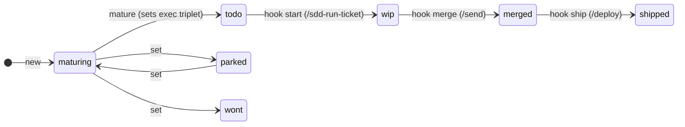

# backlog-as-data

**A spec-driven backlog and agent-orchestration system for Claude Code, where the
backlog is git data — not a document.**

> **What this is (and is not).** This repo is the extraction of a personal system
> that runs daily on real projects. It is published as a **reference
> implementation** — read it, steal ideas from it, adapt pieces of it, or run it.
> It is **not a supported product**: no roadmap, no issue triage promised, and
> nothing here is versioned for your convenience.
>
> **On installers, precisely.** The CLI has one — `init` bootstraps a project in
> a single command, and that is [Route B](#route-b--the-cli) below. The
> *pipeline* (skills, sub-agent manuals, agent definitions, worktree conventions)
> has none: it is a manual checklist, written out in
> [Route C](#route-c--the-whole-pipeline). An earlier version of this README said
> "no installer" flatly. That was half wrong, and it discouraged people from the
> half that works.
>
> **Language.** The README explains every concept in English. The system itself
> runs in French and is published that way, in [`claude-config/`](claude-config/)
> and [`backlog-cli/`](backlog-cli/) — those are the files the harness loads and
> the ones the published tests assert against. English translations of part of it,
> made for reading, live in [`reading/`](reading/) and are labelled as the copies
> they are.
>
> **Snapshot taken 2026-09-05.** The system it is extracted from keeps moving;
> this repo is refreshed by hand, in batches, not on every commit.
>
> **New here?** Go to [Start here](#start-here-three-routes-in).

---

## TL;DR

Most agent task-management tools store tasks in a dedicated place (a `tasks.json`,
a database, a `backlog/` folder). This system makes a different bet:

**The backlog *is* the YAML frontmatter of your spec files.** One file per ticket
in `specs/`, `type: ticket` in the frontmatter, and the ticket's status is a
**field** — never a location in a document. Everything else (`backlog.json` for a
web board, `specs/backlog.md` for humans reading git) is a generated projection,
locked by a sentinel and regenerated by every mutation.

On top of that data model sit four ideas that, as far as I can tell, no
published tool combines (see [Comparison](#comparison-with-existing-tools)):

- **[Maturation with a per-ticket execution triplet](#maturation-dosing-model--effort--review-per-ticket)** —
  deciding to do a ticket and deciding *how hard to think about it* are separate
  acts. Maturing a ticket means fixing `model` / `effort` / `review` **before**
  any agent runs — and before the triplet is set,
  [fresh challengers read the spec](#mature-the-batch-is-the-unit-and-a-fresh-challenger-reads-the-spec)
  without ever seeing the conversation that produced it.
- **[Lifecycle hooks tied to the git flow](#lifecycle-hooks-tied-to-the-git-flow)** —
  `todo → wip → merged → shipped` is applied by hooks attached to the run /
  integrate / deploy commands, keyed on conventional commits
  (`feat(TICKET-ID): …`). Nobody moves the back half of the lifecycle by hand —
  a manual `set` remains an explicit, visible correction, never routine.
- **[A review gate held by the orchestrator, with fresh-context reviewers](#the-review-gate-fresh-context-reviewers-orchestrator-held-evidence)** —
  the implementing agent never spawns, briefs, or even knows about its
  reviewers. The evidence of review (reviewer count, `git status`, the review
  register) is produced by the orchestrator, never by the entity it audits.
- **[Commitment and lifecycle as orthogonal axes](#the-state-model-two-orthogonal-axes)** —
  MoSCoW priority answers "did we choose to do this?"; the lifecycle answers
  "where is it in the pipeline?". Conflating them is the most common failure
  mode I saw in LLM-managed backlogs.

Those four are the data model and the pipeline over it. The fifth thing, which
an earlier version of this README listed as an unsolved problem, is
[the loop that feeds the skill](#the-loop-that-feeds-the-skill-this-section-used-to-be-the-open-problem):
friction gets captured raw, mined for what actually repeats, and routed into
whichever mechanism already owns it — with the human kept as the filter on
purpose.

## Why

This came out of running Claude Code daily on a solo project with many parallel
agent sessions. Markdown to-do documents kept failing in the same ways:

- **"Move it to Done" is not an operation** — LLMs (and humans) mangle documents
  when a state change means relocating text. Making status a field makes every
  transition a one-line, idempotent, testable mutation.
- **Two sources of truth always diverge.** If the board and the specs are edited
  independently, they drift. Here the specs' frontmatter is canonical; the board
  and the readable view are projections with a coherence test (regenerate, then
  fail if git sees a diff).
- **Parallel agents stomp on shared documents.** With one file per ticket and
  hooks that commit only the files they actually touched, parallel sessions
  stopped colliding on the backlog.
- **A backlog managed *by* agents needs machine-checkable invariants**, not
  conventions. The invariants live in a Zod schema and a hand-rolled, bounded
  YAML-subset parser (round-trip-safe, CRLF-tolerant), enforced by every CLI
  entry point.

### The stance behind it: code as a black box

A personal disclosure, because it explains most of the design. I'm a scrum
master; I was a developer ten years ago. I have enough background to discuss
design and trade-offs with an LLM — but with SDD I made a deliberate choice to
treat the code as a **black box, controlled by tests**. The specs define the
tests; the tests control the code; **I never read the code.**

That is my own bet, and only mine — I am not claiming it is what everyone
should do. But it is what forced this system into existence: when nobody reads
the code, the process has to carry the trust that a code-reading human would
normally provide. Hence machine-checkable invariants everywhere, hence a
review gate that is fully automated (fresh-context reviewers instead of my
eyes), and hence its role: not a ceremony that certifies quality, but a lean
mechanism — catch the misses as early as possible, at the lowest possible
cost. The dosage (`review: none|light|deep`, decided at maturation) is exactly
that lean calibration: pay for defect detection in proportion to the cost of a
defect slipping through.

## The data model

A ticket is a markdown file in `specs/` whose frontmatter carries the state:

```markdown
---
id: ANALYTICS-02
title: Batch-compute cast rates when null
type: ticket
status: todo
priority: should
epic: analytics
exec:
  model: sonnet
  effort: medium
  review: light
  matured: 2026-06-12
---

# ANALYTICS-02 — Batch-compute cast rates when null

The spec body. Design, contracts, test cases. The ticket file IS the spec —
or points to a domain spec that is.
```

Everything below the frontmatter is the spec: free prose. It could be written
by anyone — here it is written **by the LLM**: I express a need in
conversation, the agent challenges it, and once we agree, the agent writes the
spec (see [How a ticket flows](#how-a-ticket-flows-end-to-end)). The
frontmatter is data: owned by the CLI, mutated only through it. That split is
the whole trick — spec-writing stays a writing activity (a conversational one,
in my case), backlog management becomes data manipulation, and they live in
the same file so they can never drift apart.

Mutations go through a CLI (bundled to a single self-contained `.mjs`, installed
once in `~/.claude/tools/backlog/`, operating on whatever project `cwd` is in).
Note that the CLI is **agent-facing**: in practice the human never types these
commands — they state intents in conversation, and the agent maps them to
exactly one CLI verb (see [How a ticket flows](#how-a-ticket-flows-end-to-end)):

```
backlog new ANALYTICS-02 --epic analytics --priority should   # creates in `maturing`
backlog mature ANALYTICS-02 --model sonnet --effort medium --review light --date 2026-06-12
backlog set ANALYTICS-02 status=parked                         # explicit correction only
backlog snapshot                                               # regenerate projections
backlog list                                                   # terminal view, no web board needed
backlog init                                                   # adopt on any project: .gitattributes + empty backlog.json + specs/
```

Every mutation regenerates **both** projections in the same gesture:
`backlog.json` and `specs/backlog.md` (readable in git). This is what
projections are *for*: in my setup, a small web board on my server renders
`backlog.json` to visualize the backlog, and since every ticket carries its
`file` path, clicking a card opens GitHub directly on the spec. The board
needs zero write access — it is a pure view over git data, and any other view
(the `backlog list` terminal command, the generated markdown) is just another
projection of the same frontmatter.

The generated view opens with a sentinel comment — `DO NOT EDIT BY HAND` —
and the renderer **refuses to overwrite a file that lacks the sentinel**, so a
legacy hand-written backlog restored by a bad merge can never be silently
clobbered, and a hand-edit is flagged instead of being overwritten in silence.

### The state model: two orthogonal axes


```mermaid
stateDiagram-v2
    direction LR
    [*] --> maturing : new
    maturing --> todo : mature (sets exec triplet)
    todo --> wip : hook start (/sdd-run-ticket)
    wip --> merged : hook merge (/send)
    merged --> shipped : hook ship (/deploy)
    maturing --> parked : set
    parked --> maturing : set
    maturing --> wont : set
```

- **Axis 1 — Commitment**: `priority: must|should|could` (we chose to do it) ·
  `status: parked` (still deciding) · `status: wont` (decided against).
- **Axis 2 — Lifecycle**: `maturing → todo → wip → merged → shipped`.

The two axes are orthogonal, and the distinction that LLMs get wrong most often
is: **"not yet matured" ≠ "parked"**. A ticket you *know* you want but haven't
sized yet is `maturing` + a priority — not `parked`. I saw this conflation
repeatedly before making it an explicit rule.

The invariant tying the axes together: the `exec` block is **required** for
`todo/wip/merged`, **optional** for `shipped` (historical tickets migrated
without traced maturation), **forbidden** otherwise. Setting a matured ticket
back to `parked` removes `exec` automatically ("dematuration") — otherwise `set`
would be a dead end for matured tickets.

## The ideas in detail

### The backlog is git data

Covered above, but three design points are worth stealing on their own:

- **Status is a field, never a location.** There is no "Done section". The
  readable view groups by status, but it's generated — nobody edits it.
- **Projections are locked and tested.** A coherence test regenerates the
  snapshot and fails if git sees a diff. Stale projections can't survive a
  `/send` (integration) because the test runs in its guard step.
- **The parser is deliberately tiny.** A bounded YAML subset: top-level scalars,
  one nesting level (the `exec:` block), comma-separated scalars for lists, no
  multi-line values — free text belongs in the body, never the frontmatter.
  Small enough to be round-trip-safe and CRLF-proof, which is what lets the
  serializer rewrite files without ever mangling a spec.
- **Ticket ids are allocated against `main`, not the current worktree.** Since
  every conversation lives in its own worktree, an id that looks free locally
  may already be shipped on main (the branch forked before it landed). So
  `backlog new` also reads the ids present on the integration branch
  (`git ls-tree main:specs`, read-only, never fatal) and refuses a taken id
  with a suggestion for the next free one — always *beyond the highest taken*,
  never reusing a gap: history may already carry a `feat(SCOPE-41): …` for
  something else, and gaps are free. The residual race (two parallel sessions
  grabbing the same number between two syncs) surfaces as an add/add conflict
  at merge, and the LLM resolves it there by renumbering its own ticket.

### Maturing a spec: seven checks before a clause gets written

"Maturing" a ticket covers two different acts that share a name. One is dosing
the triplet, below. The other is writing the spec — deciding what the ticket
actually prescribes — and that is where an LLM writing specs fails, in a way that
turned out to be repetitive enough to write down. The failures all have the same
shape: **the spec is confident about a repository it did not open.**

The checks live in their own file, [`claude-config/rules/maturation.md`](claude-config/rules/maturation.md),
loaded by path scope rather than copied into the global `CLAUDE.md` — which keeps
only their seven titles, as a reminder, with a test asserting the two copies say
the same thing. They apply before a clause is written:

1. **Grep the name, not only the carriers you know about.** Search the whole repo
   for the name of the thing the ticket changes — function, constant, path, a
   prescriptive sentence — comments and test fixtures included. A carrier you did
   not grep is a carrier you did not see.
2. **Follow the side effect of the gesture you are prescribing.** For each one:
   what references the thing I am inserting, moving, or deleting? Inserting
   shifts line numbers. Moving a comment widens the scope of what it asserts.
   Deleting a site makes everything citing it stale.
3. **Enumerate the branches of the mechanism you touch.** A scope that touches a
   predicate, a dosage, or a state machine has to say what it does with *every*
   case — not only the one that motivated the ticket.
4. **Read your own clauses against each other.** Never write "X is unchanged"
   without checking that the prescribed gesture does not touch X. A
   non-regression clause *enumerates* the cases that stay green and *names* the
   ones this ticket invalidates. "All of them, untouched" is not a clause, it is
   a hope.
5. **Open the repository the spec targets.** What a clause prescribes *in* a repo
   is verified *in* that repo, before being written: a command it cites exists in
   that project's manifest **and** is permitted by that project's rules — "the
   script exists" is not "the script is allowed"; a file it promises to deliver
   is actually tracked by git; a path it names exists. In cross-repo work this is
   the normal case, not the edge case: the spec is written from a session open
   somewhere else.
6. **Never freeze a first-come allocated value.** A ticket id, a port, a
   migration number — anything another session can take between the moment the
   spec writes it and the moment someone implements it. The test is exactly
   that question: *can a parallel session claim this before it is used?* If it
   can, it is execution data, not spec data, and freezing it is wrong in
   advance — even where check 5 confirmed it was free at the time of writing.
7. **A clause stating an observable fact cites how to observe it.** Repository
   state or third-party behaviour: a list, a regime ("here we do not touch X"),
   an inventory, a threshold. The fact is observed before the clause is written,
   and the spec names **the means** — the command for repository state, the doc
   page of the version in use, or the package's own code for a dependency. The
   means, not the output, so a later reader can replay it. Bounded to clauses
   that *observe*; design decisions are not observations and are exempt.

**Closing an escalation feeds this list.** When an escalation was caused by a
false clause rather than by a disagreement about the product, its closure must
carry a diagnosis line answering one closed question: **which of the seven checks
should have caught this?** Two outcomes only — a number from 1 to 7, or `none`.
And `none` additionally requires opening a ticket against the method itself,
whose id goes in the same line. That is what separates "the method has a hole"
from "I did not follow it", two problems with opposite answers. The friction is
deliberate: an open escalation stays visible in `backlog escalations`, so closing
one costs more than leaving it — and a closure without a diagnosis is information
destroyed.

### Maturation: dosing model / effort / review per ticket

`backlog mature` is the moment a ticket becomes runnable, and it forces three
decisions *as data*:

| Field | Values | What it doses |
|---|---|---|
| `model` | `opus` · `sonnet` (· `fable`) | Which model implements the ticket |
| `effort` | `low` · `medium` · `high` · `xhigh` · `max` | The sub-agent's **actual** reasoning tier |
| `review` | `none` · `light` · `deep` | The review gate: 0, 1, or 3 fresh-context reviewers |

`effort` is not a word in a prompt. The harness has no effort parameter on the
spawn call, so the only mechanical lever is the `effort:` field of an agent
definition — the runner keeps one agent-def per tier (`sdd-impl-low` …
`sdd-impl-max`) and selects it from this field, overriding only the model per
call. The prompt still states the tier as well, as a backstop; the agent-def is
what actually moves the dial.

Why this matters: agent runs have a per-ticket cost/quality trade-off, and the
right place to decide it is **at planning time, deliberately** — not at launch
time, implicitly, by whoever happens to type the command. A trivial rename gets
`sonnet / low / none`. An irreversible data migration gets `opus / max / deep`.
The decision is versioned with the ticket and auditable after the fact
(`matured: <date>`).

Three hard-won rules ride along:

- **`review` absent = `light`, and the default lives in the consumer** — the
  runner applies it; the CLI never writes a default into the frontmatter. Data
  records decisions; defaults are behavior.
- **I rejected a mandatory `--review-why` justification.** Asking a model to
  justify its dosing produces post-hoc rationalization, not deliberation. On a
  real ticket, the maturing agent chose `deep` and was right, while a
  second opinion argued `light` and was wrong — a written justification would
  not have distinguished them. Criterion that actually works: *if this defect
  slipped through, would anything else catch it?* No test would catch it, or
  publicly visible → `deep`. Will explode on next use anyway → `light`.
- **The triplet has a floor, checked by the tool: `high`/`xhigh`/`max` require
  at least `opus`.** A high reasoning tier on a cheap model is the combination
  that produces confident nonsense, so `mature` refuses it. It is a *floor*,
  not a pairing — `opus` on a `low` effort is never questioned, and `low`/
  `medium` have no floor at all. Overriding it is `--override-coherence`: a
  **gesture, not a written justification**, for exactly the reason
  `--review-why` was rejected above. `fable` is an accepted value but is
  classified nowhere in the scale, so it is *refused* above the floor rather
  than presumed above it.

One migration note, because it is the reason this renaming cost nothing. Both
vocabularies changed after the system was already in daily use: `haiku` was
dropped from the scale (zero observed use, and anything
trivial enough for it is already safe on `sonnet`), and the old effort names
were renamed to the harness's real tiers. The parser is **tolerant on
read, strict on write**: a historical ticket carrying `effort: think-hard` still
loads and is normalized to `high` in the projection, while `mature` refuses to
*write* a legacy value. So the tickets already on disk were never rewritten —
and `backlog.json` nonetheless contains only official values.
[`examples/specs/skill-13.md`](examples/specs/skill-13.md) is one of them, kept
as an example precisely because it still says `effort: ultrathink`.

### `/mature`: the batch is the unit, and a fresh challenger reads the spec

Everything above describes what maturing *is*. The skill that performs it —
[`claude-config/commands/mature.md`](claude-config/commands/mature.md) — is
worth its own section, because two of its design choices were not obvious and
neither is visible from the CLI verb it eventually calls.

**Its unit is the batch, not the ticket.** Maturation almost never happens alone:
it happens mid-conversation, over several tickets at once, upstream of a run
launched somewhere else — "mature the first wave", "ok for the three, mature
them". A skill whose unit was the single ticket would have been the wrong shape
for the gesture people actually make.

**It reads the open escalations before it reads its arguments.** Closing an E1
escalation *is* re-maturing — same method, same gate — so there is one verb and
not two: the skill lists the escalations itself and switches into arbitration
without being asked. That is also where the diagnosis line described above gets
written.

**And before the triplet is dosed, fresh challengers read the specs.** This is
the review gate's principle moved to planning time, and it turns on one barrier:

> The challenger reads **the spec files** the skill just wrote, and **never the
> maturation conversation**. You, the orchestrator, have been sold by that
> conversation. The challenger arrives having been convinced of nothing —
> exactly like the gate's reviewers, who see the diff and not the reasoning that
> produced it. Nothing from the conversation crosses: no summary, no
> justification of the choices, no "where to look".

The number of challengers is **dosed on the batch**, not fixed, on a rule whose
deterministic half is the batch size and whose semantic half stays the
orchestrator's read:

| Case | Challengers | Lenses | Trigger |
|---|---|---|---|
| 0 | none | — | a batch of 1–2, with no case-2 signal |
| 1 | 1 | architecture + skeptic, combined | a batch of 3–5, no case-2 signal |
| 2 | 2 | architecture · skeptic, separately | **any** of: several sub-systems · a schema or data-model change · a gate or external dependency · code previously removed being resurrected |
| 3 | 3 | architecture · skeptic · **slicing/sequencing** | a batch of ≥ 6 |

The third lens exists for a failure mode the other two miss: the framing is
right and the **order** is wrong. And case 0 spawns nothing *and writes no
`## Challenge` section* — an empty section would claim a challenge happened,
which is the same manufactured evidence as a review register reporting `0
findings` when nobody looked.

### How a batch gets matured (end to end)

The back half of the pipeline gets a walkthrough further down; here is the front
half, which is where the decisions are actually made.

```
you        "mature the first wave" — or "ok for the three, mature them"
agent      /mature SKILL-98 SKILL-99 SKILL-101

  1 batch    for EACH id, the target repo is resolved by the SAME preflight
             tool /sdd-run-ticket calls — never presumed equal to the session's.
             A batch can be matured from one repo and live in another; that is
             the nominal case for a global-skill ticket. Session not inside a
             git repo → STOP, and no fallback root is invented

  2 escal.   `backlog escalations`, UNCONDITIONALLY and before anything else —
             including when you only asked for maturation. The verb always
             prints something and always exits 0, so the skill branches on what
             it SAYS, never on an empty stdout or a return code. Open ones are
             then intersected with the batch: escalations belonging to other
             tickets are reported and NOT treated — the batch is what you named,
             not what the tool found

  3 arbitr.  one escalation at a time, three blocks in a fixed order, and it
             WAITS for you. This is the one blocking point of the skill

  4 gate     closing engraves a marker in a spec, so it is gated. An E1 caused
             by a false clause needs its diagnosis line first — a number 1-7, or
             `none`. `none` additionally requires a ticket opened against the
             method itself, its id cited in that same line. And any arbitration
             that produces work needs its treating ticket opened first: the tool
             engraves `--by` verbatim without validating it, so an id not yet
             allocated engraves a ticket that does not exist
             ⛔ ids are never invented, and never derived from a listing read
             earlier in the conversation — step 3 blocks for an arbitrarily long
             time, and a parallel session can take the number meanwhile. The
             next free id is observed immediately before `new`, not before

  5 specs    each spec body is written — scope, test list, verification — under
             the seven checks, re-read from their file rather than from memory

  5.5 chall. N fresh challengers, dosed on the batch size, reading only the spec
             files just written. Their arbitration is written into the spec

  6 triplet  `backlog mature <ID> --model … --effort … --review … --date …`,
             one call per ticket, the date passed explicitly because the CLI
             never invents one. The regime is indexed on the ticket's STATUS,
             not on whether the triplet changed — and a `todo`+ ticket whose
             triplet is unchanged gets NO call at all, because `mature` would
             rewrite `matured` to today and erase the date the triplet was
             really decided. `parked`/`wont` stop: they are a commitment, not a
             pipeline stage, and un-parking comes first

  recap      ⚠️ displayed BEFORE the first mutation, not after. It enumerates the
             five side effects the rest will produce, and steps 4, 5.5 and 6
             mutate nothing until it is approved. It is written last in the
             skill file only because the batch has to be known to fill it in —
             a recap shown afterwards protects nothing, and answering "no" to it
             would no longer cancel anything
```

The shape worth noticing: **one blocking point (arbitration) and one barrier
(the recap)**, and everything else runs without asking. Compare that with the
back half, where the human's touchpoints are also decisions and never mechanics.

### Lifecycle hooks tied to the git flow

The back half of the lifecycle (`wip → merged → shipped`) is **never set by
hand**. Three workflow commands each fire a hook:

| Command | Hook | Transition |
|---|---|---|
| `/sdd-run-ticket X` (launch an implementer) | `hook start X` | `todo → wip`, for that id only |
| `/send` (rebase + fast-forward into main) | `hook merge` | every `wip` whose `feat(ID):`/`fix(ID):` commit is **actually on the integration branch** → `merged` |
| `/deploy` (verify + push to prod) | `hook ship` | every `merged` → `shipped` (a deploy pushes all of main) |

Design decisions that took incidents to learn:

- **`merge` promotes only tickets whose implementation commit is on the
  branch** — read from commit *subjects*, only `feat(...)`/`fix(...)`
  conventional scopes. Body mentions and `chore(backlog): start X` commits used
  to cause premature promotions.
- **Hooks always exit 0.** A project without a backlog, an unknown event, a
  failed transition — all warnings, never failures. Lifecycle automation must
  never block integration or deployment.
- **Hook commits are surgical.** The main checkout is shared by many parallel
  sessions. `git add specs/` would sweep up a neighbor session's in-progress
  ticket (this happened — 2026-07-17). Hooks commit **only the files of tickets
  they actually transitioned**, with `git commit --only -- <paths>`.
- **Chained hooks mean a ticket coded outside the pipeline stays `todo`** — the
  merge hook only promotes `wip`. That's a feature: the manual `set` correction
  is legitimate then, and visible as such.

### The cross-repo flow: everything works, in the wrong tree

The ownership rule says a ticket is opened where its deliverable lives — so a
ticket whose deliverable is a global skill lives in the config repository, even
when you are working in a completely different project. That makes running a
ticket from *elsewhere* the normal case, not an edge case, and it is a whole flow
the rest of this README would otherwise leave invisible.

The mechanical problem is narrow and total: the harness's built-in worktree
isolation forks **the session's** repository, not the ticket's. Used cross-repo it
produces a perfectly valid isolated worktree of the wrong project, in which
everything then succeeds — the agent works, the tests pass, the commit lands. This
is the system's central failure mode, and it is named as such in the skill: *tout
marche, mais dans le mauvais arbre*.

So the skill runs in one of two modes, and three things about how it decides are
worth stealing:

- **The criterion is the shared git dir, not where the ticket lives.** A session
  already working inside a worktree of the config repository stays in same-repo
  mode, even though the ticket "belongs elsewhere" by the ownership rule. Deciding
  on the ticket's home instead would misfire on exactly the case that occurs most.
- **Cross-repo, the built-in isolation is not used at all.** The orchestrator
  mounts the worktree itself against the target repository and spawns the agent
  without isolation — and every `git` command in the skill is then prefixed with
  an explicit `-C`, target root or worktree path. Never the implicit current
  directory, which is the thing that silently points at the session's repo.
- **The blocks are written to be correct in both modes.** The target root is not
  assumed equal to the session root even in same-repo mode, because a worktree and
  its main checkout are not the same path either. A rule that only holds in the
  exceptional mode is a rule someone will apply in the nominal one.

The two implementer manuals exist for this split, and it is also why the sub-agent
verifies where it is before writing anything rather than trusting that it was
launched correctly.

### The review gate: fresh-context reviewers, orchestrator-held evidence

`/sdd-run-ticket` runs the full loop for one ticket: preflight guards →
implementer sub-agent in an isolated git worktree → review gate → findings sent
back → integration. The gate design is the part I have not seen elsewhere:

- **Reviewers arrive with a blank context.** They get the ticket id, the spec
  path, the worktree path, the commit SHA, and four review axes — *nothing
  else*. No summary of what the implementer did, no justification of choices, no
  hints of where to look. Contaminating the reviewer's context is the main
  vector for confirmation bias, so the reviewer prompt is a frozen template
  where only mechanical values are substituted.
- **The orchestrator, not the implementer, holds the evidence.** The implementer
  never knows the review dosage, never sees the reviewer prompt, and cannot
  attest to anything about the review. The orchestrator constates `git status
  --porcelain` before and after the review (reviewers keep write tools
  technically — the read-only rule is declarative, so the check is the real
  guarantee), reads the SHA programmatically (a hand-transcribed SHA once
  arrived with 39 characters and broke the reviewer's location assertion), and
  publishes a **review register**: findings in, dispositions out, one line per
  unique finding, with a mechanical completeness check.
- **The fixes are made by a fresh corrector, not by the implementer.** This one
  reversed: the findings used to go back to the implementing sub-agent, resumed
  with its context intact. It is now a new sub-agent — same model, same effort,
  the same worktree holding the reviewed commit (and therefore *no* fresh
  isolation, or it would "fix" a tree that does not contain the commit). Two
  reasons, and the second is the general one. What the implementer had was not
  actually missing: the corrector re-reads its manual **in full**, and the
  rationale behind the conservative choices is in the commit messages, which
  `git log` gives it. And keeping the resume path as a fallback was worse than
  removing it — **a path never taken degrades without a witness**, the same
  argument that forbids copying a manual into a spawn prompt. So there is one
  mode and no fallback.
- **Findings have exactly two exits: fixed, or escalated with justification.**
  The corrector triages every finding into fix, or one of three closed
  escapes — E1 (fix requires changing the spec), E2 (pre-existing debt → open a
  ticket via the CLI), E3 (fix breaks an existing green test). No silent
  dismissal: "not a big deal" is not a disposition. E2 has its own trap,
  documented after a real miss: pre-existing-ness is tested on *"would the
  defect exist if my ticket had never shipped?"*, never on *"is the file inside
  my diff?"* — stale docs about your new flag are in scope even though the doc
  file is old.
- **Reviewers report findings-only, no praise.** A report that says "everything
  else conforms" manufactures false confidence — it once accompanied a report
  that declared conformant the very decisions it was missing a defect in. And
  "0 findings + remarks in prose" is a contradiction: an off-format remark *is*
  a finding someone filtered.
- **The review runs at a fixed setting, not the session's.** Reviewers are
  spawned through a dedicated agent definition pinned to a strong model and a
  high reasoning tier, and the spawn passes **no** model parameter. Before that,
  a reviewer inherited whatever the orchestrating session happened to be running
  — so the same `deep` dosage bought a strong review or a weak one depending on
  a setting nobody was thinking about at that moment. The *number* of reviewers
  stays a per-ticket dosage; their **power** stopped being one.
- **One round.** After dispositions, no second wave of reviewers. Review gates
  that loop become polishing loops.

Dosage recap: `none` — no gate; `light` (default) — 1 reviewer, all four axes;
`deep` — 3 reviewers in parallel, each with **all four axes** plus a different
priority lens. Axes are never partitioned: on a real `deep` run, no reviewer
stayed in its lane and the most lane-disciplined reviewer found the *least*.
`deep` buys three decorrelated samples of the same diff, not three complementary
coverages.

⚠️ **"In parallel" is a property of how they are spawned, not of a flag.** The
three reviewers go out as three `Agent` calls **in a single message** — that
grouping is what makes them concurrent; a background flag does not. Spawned one
per message they run in sequence, and the gate silently costs three times the
wall-clock it should while looking identical in the register. This is written
down because it recurred: knowing the rule turns out not to be the same as
performing it under load.

Decorrelation is protected mechanically, not just intended. At `deep` each
reviewer writes to its **own** report file, outside any repository — never a
shared one, because with a shared file a reviewer would read another's findings
and the independence that is the entire value of the dosage would be gone. And
each run computes a **fresh** suffix for those paths, so that re-running the
gate on the same ticket after an abort cannot have a reviewer pick up a stale
report from the previous attempt.

Three samples of the same diff overlap, so `deep` adds a fourth sub-agent: an
**aggregator** that never reads code. It gets the three raw report files and
returns one deduplicated list, renumbered from 1, each entry copied verbatim
from one of its sources — never rephrased. Two rules make it worth its cost:

- **It is blind to provenance.** It is not told which reviewer wrote which
  report, nor which lens each had. It cannot weight a finding by its author,
  because it does not know the author.
- **The deduplicated list carries no attribution either** — not the reviewer,
  not the dosage, and above all **not how many of the three reported it**. That
  count exists, in a separate correspondence table mapping every raw finding to
  the unique it landed on; but that table goes to the orchestrator, not to the
  implementer. The implementer must not get to reason "only one of three flagged
  this, so it is probably noise" — that is exactly the silent dismissal the
  disposition rule forbids. The table's real job is arithmetic: its row count
  must equal the sum of the three reports' totals, which is how the orchestrator
  proves nothing was lost in the merge.

### An escalation is a row, not a remark

The gate produces two kinds of residue. Fixed findings leave a commit. Escalated
ones used to leave *nothing*: the register was published in conversation and died
with the session, so "someone must arbitrate this" survived only as long as the
operator remembered it.

E1 in particular deserves better than that. It means *the "what" has to change* —
so its most frequent object is a defect **in the spec itself**, found by a
reviewer who read the code against a contract that turned out to be wrong. The
implementer cannot fix it: it is forbidden to touch the spec, and that
prohibition is the whole reason the review has a fixed contract to judge against.

There are **three** sources, and the third one had to be fenced carefully. A
reviewer's finding, escalated by the corrector. The implementer's own first-pass
declaration, when it hits a contradictory spec before any review. And the
orchestrator's **own observation**, formed while writing the register — which is
the dangerous one, because an orchestrator that may escalate what it notices is
one step from being a second, unaccountable reviewer. So it is bounded by three
cumulative conditions, and a missing condition closes it rather than softening
it: the observation must be **anchored** in something the register already
carries, crossed with a *named* clause of the spec (otherwise it is a re-read,
and this step is not a second gate); the orchestrator must lack **authority**,
not capability — the line is between writing the escalation, which makes
arbitration possible, and making the call itself; and the information must
**perish** otherwise, having no finding, disposition or ticket to carry it. A
defect the corrector *could* have fixed is a finding the gate missed, and
manufacturing an escalation to house it is the exact inverse of this mechanism.

So the orchestrator writes it down, in the ticket's own spec file:

- **In the body, never the frontmatter.** The frontmatter is mutated exclusively
  by the CLI; an escalation is prose. It gets appended under a single
  `## Escalations` container, one level-3 heading per escalation.
- **The heading is a machine contract.** Its title must *start* with the tag
  (`E1`, `E3`, `E1/E3`, optionally suffixed — `E1 (finding 2)`). That is not
  decoration: a `backlog escalations` verb scans every spec in the project and
  lists the open ones. The system does not leave that recognition to inference —
  the repo that *produces* escalations guarantees the shape the reader expects.
- **A separate commit** — `docs(TICKET-ID): escalation E1`, never folded into the
  code commit that went through the gate. What was not reviewed stays visible as
  not-reviewed.
- **The orchestrator does not arbitrate; it makes arbitration possible.** The
  required content is what a human needs in order to decide: what the gate found
  and what makes it true (file, line, quote), why the implementer could not fix
  it, and the possible ways out — explicitly *not* ranked.

Closing one is `escalations close <ID> --by <ID> --date …`, which inserts a
marker — and **only that marker counts**. An escalation "closed" by editing its
title in prose is not recognized and stays listed as open. That is a deliberate
consequence, not an oversight: a state a machine reports must have exactly one
writer, or the report becomes a matter of interpretation.

Two details are there because the alternative was silent loss. A heading inside
the container that does *not* start with the grammar but nonetheless contains an
`E1`/`E3` token looks far more like a mistyped escalation than like prose — so it
is reported on stderr, with its file and line, and never listed as an escalation.
And the reader accepts the older pre-container shape too, because escalations
written before the convention existed are exactly the ones nobody would think to
go looking for.

What this changes in practice: at the end of a cycle the operator gets a *list*,
not a memory. And because an escalation names the ticket whose spec it lives in,
the arbitration lands where the work is.

## Who does what: scripts attest, the LLM judges, sub-agents generate

Mapping the whole pipeline by *who performs each step* reveals the system's
quiet design rule. Every step is one of three kinds:

- **Deterministic scripts** — the preflight resolver (`resolve`/`locate`), the
  lifecycle hooks, git operations, coherence tests. They emit JSON or exit
  codes; they are the only producers of **evidence** (the commit SHA, the
  `git status` proofs, the backlog statuses). *Attestation is always produced
  by a script, never by the entity it controls.*
- **LLM judgment (orchestrator)** — scope arbitration, spec writing,
  dependency confirmation, writing the review register, writing escalations
  into the spec. Things that genuinely require judgment, kept in conversation.
- **LLM generation (sub-agents)** — the implementer, the reviewers, the
  aggregator, the corrector that applies the findings, and the challengers that
  read a matured spec before any of them exist. The generative work, behind
  guards on both sides. Merging duplicate findings used to sit in the bullet
  above, as orchestrator judgment; it moved here once it got its own blind
  sub-agent, which is a better place for it — the orchestrator now *checks* the
  merge (the row count) instead of performing it.

  Note what the five have in common: **every one of them arrives without the
  conversation that produced its input.** That is not a coincidence of five
  designs, it is the same design applied five times — and it is the single most
  transplantable thing in this repository.

The design trajectory follows from incidents: **every time a mechanical step
lived as prose instructions executed by the LLM, it eventually failed** — a
tilde not expanded, an `awk` positional field eaten by placeholder
substitution, a SHA hand-transcribed to 39 characters. Each of those steps was
moved out of prose into a deterministic tool that the skill calls once and
reads JSON from. Prose is for judgment; mechanics get a script. The guards are
the same story in decision form: every checkpoint is **fail-closed** (ticket
not found, maturation not on main, dirty tree, SHA mismatch → STOP), so the
pipeline stops rather than drift into "everything works, but in the wrong
tree".

The most recent application of that rule is measurement. The review register is
published in conversation and dies with the session, so a writer script now
persists its durable part: one JSON file per ticket cycle, in a separate data
repo — dosage, reviewer count, raw and unique finding counts, and each finding's
disposition with the SHA that fixed it or the ticket that inherited it. The split
is the same one as everywhere else. What the orchestrator *decided*, it passes as
arguments; what can be *observed* — token counts, the run's rank in the session —
the writer reads from the transcript, and the orchestrator is not allowed to
declare it.

One quantity refused to be read that way, and it is the one that matters most
here: **the transcript carries no `cache_read` for sub-agents**, which is exactly
the dominant term of a cycle's cost. So there is a small local OTLP collector
listening on loopback for the harness's own token-usage telemetry, writing one
snapshot per session. It exists for a single missing number — and the split holds
even there: it *observes*, it never lets anything declare. Two consequences fell out of that. The command has to be run by the
orchestrator from its own shell, because a sub-agent running it would measure
**its own** transcript — a different quantity, silently. And a finding's fix SHA
is recorded before integration rebases it, so the writer itself checks whether
that SHA is still reachable from the branch, rather than trusting the number it
was handed. When that check comes back false, it now has to carry **why** —
an unreachable SHA and a SHA nobody could verify are different facts, and a bare
`false` collapsed them.

Adding the fresh corrector broke the measurement in a way worth recording,
because the failure mode is the one this whole section is about. The corrector is
spawned with the same parameters as the implementer, so it arrived carrying the
same description — and the writer, which keeps the ticket's **last** spawn,
silently started measuring the correction instead of the cycle. Nothing errored;
the record was simply plausible and false. The fix is a literal `(correction)`
suffix on that one description, and it is documented as load-bearing so nobody
tidies it away as decoration.

One rule of the register carried over into the file, and it is the one worth
stealing: at dosage `none`, the finding counts are **omitted, not zeroed**.
Nobody looked, so `0 findings` would be manufactured evidence — and a row of
zeroes is indistinguishable, later, from a review that ran and found nothing.

## The skill became a program, and it has a size budget

The orchestration skill is a little over 100 KB of markdown — its ceiling stands
at 104,320 bytes as of this snapshot. At that size it is no longer prose with a
few commands in it — it is a program, and it acquired the two things programs
need: modules, and a budget.

The modules are split by **who reads them**, which turned out to be the only
distinction that matters:

| Family | Reader | When |
|---|---|---|
| the skill file | the orchestrator | always |
| `prompts/*.md` | the **sub-agents themselves** | at the start of their own run |
| `steps/*.md` | the orchestrator | conditionally — the cross-repo branch, the aggregation body at dosage `deep` |

`prompts/` is the interesting one, because it changed a guarantee rather than a
layout. The reviewer's manual — its location assertion, its prohibitions, the
four review axes, its output format — used to be *injected*: the skill held the
text, and the orchestrator copied it into the spawn prompt. Now the spawn prompt
carries only variables and a pointer, and the sub-agent resolves the path and
reads the manual itself before doing anything else (and stops, loudly, if it
cannot read it). The axes stopped being a transcription and became invariants of
a file. No reviewer can be handed three axes out of four because a copy got
tired.

It also makes a hot-swap possible that the injected version could not: an edit to
a manual takes effect on the **next** launch, including for sub-agents working in
a completely different repository — and never on an agent already in flight.

The budget is a byte ceiling per family, asserted by a test. Nothing forbids
growth: raising a ceiling is a **one-line edit, in the commit that grew the
file**, visible in the diff. That is the entire mechanism, and the details are
where the intent lives:

- The ceilings sit in their own dedicated test file, precisely so that raising
  one is a one-line edit rather than surgery in the middle of a large shared
  test file. Several tickets that write into the skill each contradict the
  ceiling and each have to re-measure it in their own commit. That is the
  designed behavior, not friction to be smoothed away.
- **A ceiling is an observation, not a target.** No reduction percentage is
  promised, and the point was never to make the skill small. The point is that
  growing it is a deliberate, reviewable act instead of a silent one — which is
  what a modular split alone does *not* give you: without the ceiling, the skill
  could re-absorb every byte that had just been extracted into `prompts/`, by
  plain copy-paste, without a single test moving.
- There are **five** ceilings, and the last two are singled out by their reader
  rather than by their size. The global `CLAUDE.md` (13,125 bytes) is loaded by
  the harness on **every** session of **every** project and injected into every
  sub-agent spawned; `rules/` (9,659) holds the path-scoped rules, the maturation
  method among them. The first three cost something only inside a cycle. These
  two cost something always, which is why the method was moved *out* of
  `CLAUDE.md` into `rules/` and left only its seven titles behind.

The five, as of this snapshot: skill 104,320 · `prompts/` 67,863 · `steps/`
10,535 · `CLAUDE.md` 13,125 · `rules/` 9,659. They are in
[`claude-config/__tests__/skill-size-ceiling-coherence.test.js`](claude-config/__tests__/skill-size-ceiling-coherence.test.js),
where each one carries, in a comment, the dated reason it was last raised.

## The other budget: what a session costs, and where to cut it

The ceilings above bound a **file**. They say nothing about the quantity that
actually gets spent, which is the context a session carries from one ticket to
the next. Two rules bound that one:

- **Mature continuously** — in the session where the question comes up, rather
  than accumulating tickets to mature in a dedicated launching session.
- **Launch in waves of three to five tickets**, then open a fresh session.

⚠️ Do not confuse that wave with the other one. Tickets sharing a **data file**
under a coherence test (fixtures, translations) go one at a time, the second
after the first has merged. The two rules answer different risks and stack; the
session rule never relaxes the fixture rule.

The motive is not prompt size. The call prompt carries only variables now, so
there is no mass left to lose there. It is the three-beat loop the orchestrator
holds per ticket — spawn, gate, corrector — sustained over a lengthening session:
attaching each notification to the right ticket, writing the register, and above
all the measurement step, which **writes to disk** and whose error (a final SHA
borrowed from the neighbouring ticket, say) is irrecoverable and silent. Plus a
conduct risk that is specific to this system: the chain can rewrite
`sdd-run-ticket.md` *under the session executing it* — an integration mid-session
replaces that file in the live checkout — desynchronising the orchestrator's
in-context copy from disk.

**And there is a measured motive**, which is worth reproducing with its caveats
intact, because the caveats are the interesting part. Cost per cycle tends to
grow with the cycle's rank in the session — mechanically: each turn re-reads a
context that grew with every ticket. One session, five `deep` cycles, measured in
`cache_read` (the dominant term, far ahead of output):

| rank | ticket | cycle `cache_read` |
|---|---|---|
| 0 | SKILL-26 | 10.6 M |
| 1 | SKILL-28 | 14.7 M |
| 2 | SKILL-31 | 17.6 M — +66% on the first |
| 3 | SKILL-48 | 15.4 M |

The progression is **not monotonic** — rank 3 falls back below rank 2 — so
"grows" reads as a tendency, not a law verified at each step. The scope recorded
is session-to-date, so these are deltas computed by hand. The session's fifth
cycle is skewed by a parallel launch, and a cycle in another session carries a
*negative* delta, its transcript having probably been compacted. The orders of
magnitude hold; a strictly increasing progression does not.

**So the number three-to-five does not come from that table.** It comes from the
usage distribution: the observed median is 2 launches per session, and 87% of
sessions already sit under 5. The rule codifies a practice that was already the
majority and bounds the rare case that goes beyond. The table explains **why** to
split a session, never **where** to cut — and saying so is the difference between
a measured threshold and an assumed order of magnitude presented as one.

**The honest ending: this doctrine has no measurable horizon of retirement.**
Every rule here is supposed to carry the condition under which it would be
dropped, and this one's turns out not to be applicable. No field recorded per
cycle can discriminate a valid final SHA from one borrowed from the neighbouring
ticket — the existing check only observes that the SHA exists and is well formed,
never its *provenance*, and a borrowed SHA exists just as much. The obvious
candidate, reachability from the ticket's branch, can never do it either: a
ticket's branch is cut from live `main`, so anything already merged before that
branch was born — a neighbour's SHA included — is trivially reachable from it.
The retirement trigger, written before that limit was understood, is therefore
**not executable as written**. It is kept in the skill for the record rather than
deleted, labelled as such.

## How a ticket flows (end to end)

The division of labor matters: **the human never runs the CLI, never writes
frontmatter, and never edits the spec files directly**. You steer in
conversation; the agent does all the mechanics through the CLI (that is what
makes the mutations deterministic — the agent has no hand-editing path). A
typical cycle, as it actually happens — the maturation block is compressed here
because it has [its own walkthrough](#how-a-batch-gets-matured-end-to-end) above:

```
you        open a conversation on a fresh worktree:
           "we should handle X" — one ticket, or an epic to slice
you+agent  discussion until the need is agreed — requirements elicitation
           happens in chat, not in the spec file
agent      once agreed, records it:
             backlog new PARSE-07 --priority should      # status: maturing
you        "mature the wave, then run PARSE-07"
agent      /mature PARSE-07 …          (the batch is the unit, not the ticket)
  escalations  read FIRST, before the arguments: an open E1 makes this pass an
             arbitration, because closing one is re-maturing
  method     re-reads rules/maturation.md, then writes each spec body —
             scope, test list, verification — under the seven checks
  challenge  N fresh challengers, dosed on the batch size, reading ONLY the
             spec files just written and never this conversation. Their
             arbitration is written into the spec, not left in the session
  triplet    backlog mature PARSE-07 --model sonnet --effort medium \
               --review light --date 2026-07-22          # status: todo
             (the agent asks you for the review dosage rather than
             choosing in your place)
           …maturation committed and integrated into main: the implementer's
           worktree forks from main, so an unmerged maturation is invisible
           to it — a preflight guard blocks the launch until it is there
agent      /sdd-run-ticket PARSE-07
  hook       start → wip  (committed on main, scoped to this ticket's files)
  subagent   implementer sub-agent spawned in an isolated worktree forked
             from main — running THE model decided at maturation, nothing
             else: the orchestrator copies `model`/`effort` from the
             frontmatter, it does not choose, and the sub-agent's report
             must open with `Model used: …` so the decision is verifiable
             after the fact. SDD discipline: spec → failing tests → code →
             green verification → ONE commit `feat(PARSE-07): …` → report,
             then STOPS (never integrates itself)
  gate       dosage read from the frontmatter: `none` → no gate, straight
             to integration · `light` → 1 reviewer · `deep` → 3 in
             parallel, then 1 blind aggregator over their reports.
             Reviewers are FRESH sub-agents at a pinned setting, never
             the session's: blank context — ticket id, spec path,
             worktree, SHA, and a pointer to the manual they read
             themselves (all four axes each, always; `deep` adds a
             different priority lens per reviewer, never a subset).
             The orchestrator locates worktree+SHA programmatically,
             collects the reviewers' reports, checks git status unchanged —
             then spawns a FRESH CORRECTOR on the implementer's worktree
             with the raw findings, verbatim. Same model and effort, no
             `isolation` (the worktree already holds the reviewed commit).
             It triages E1/E2/E3 and fixes; the orchestrator never touches
             the code. It closes by verifying the fix commits exist and
             publishing the register
  residue    any E1/E3 escalation is APPENDED to the ticket's spec in its
             own `docs(PARSE-07): escalation` commit, tag-prefixed so the
             CLI can list it later — arbitration outlives the session.
             A per-cycle measurement file is written outside the repo
agent      /send   (run by the orchestrator from the implementer's worktree)
  hook       merge → merged  (PARSE-07's feat commit is on main)
you        "deploy"
agent      /deploy
  hook       ship → shipped  (pushed to prod in the same push)
```

The human's three touchpoints are all decisions, never mechanics: agreeing on
the need, choosing to mature-and-run (with the review dosage), and deciding to
deploy. Everything between two touchpoints is the agent's. A cycle can leave one
decision *behind* it — an escalation — but that one is deliberately not a
touchpoint: it does not block the cycle, it waits in the spec until someone runs
the verb that lists it.

The implementer also has standing orders worth stealing: never touch the
backlog artifacts (`wip`/`merged`/`shipped` come from hooks keyed on its commit
scope), never invoke integration/deploy commands itself, verify its isolated
worktree before writing (shell `cd` and file-tool sandboxes can disagree), and
rebase onto live `main` first (worktrees fork from the session's start
commit).

## What's in this repo

**The layout mirrors the two repositories the system lives in**, so a folder here
maps to a place you would create rather than to a chapter of this README.

### [`claude-config/`](claude-config/) — what lives in `~/.claude`

| Path | What |
|---|---|
| [`commands/`](claude-config/commands/) | The twelve skills. `sdd-run-ticket` (orchestration: preflight, launch, review gate, register, integration), `mature` (spec writing, escalation arbitration, challengers, triplet), `send` (integration), `deploy`, `backlog` (conversational wrapper over the CLI verbs), `reflect` (the miner), `improve-skill`, `worktree-clean`, `sync`, `sync-all`, plus two small ones outside the SDD loop |
| [`prompts/`](claude-config/prompts/) | The **sub-agents'** manuals, which they read themselves: implementer (same-repo and cross-repo), reviewer, aggregator |
| [`steps/`](claude-config/steps/) | Sections of the orchestration skill read **conditionally** by the orchestrator: the cross-repo branch, the `deep` aggregation body |
| [`rules/maturation.md`](claude-config/rules/maturation.md) | The seven checks, the escalation-closure diagnosis, the conventional-scope rule, the model scale. Path-scoped, so it loads when a spec is opened |
| [`agents/`](claude-config/agents/) | The six agent definitions. Five implementer tiers plus the pinned reviewer — **this is what makes `effort` mechanical** rather than a word in a prompt |
| [`CLAUDE.md`](claude-config/CLAUDE.md) | The doctrine the harness loads on every session of every project |
| [`claude-md-template.md`](claude-config/claude-md-template.md) | The per-project `CLAUDE.md` template |
| [`tools/sdd/preflight.mjs`](claude-config/tools/sdd/preflight.mjs) | Deterministic preflight resolver (ticket lookup, mode, worktree derivation, guards) |
| [`tools/agent-defs/generate.mjs`](claude-config/tools/agent-defs/generate.mjs) | Generates the agent definitions above; a coherence test asserts disk ↔ generator |
| [`tools/review-log/`](claude-config/tools/review-log/) | The per-cycle measurement writer, and the baseline reader that mined existing transcripts |
| [`tools/sdd-telemetry/`](claude-config/tools/sdd-telemetry/) | A local OTLP collector for the one quantity no transcript carries: the sub-agents' `cache_read` |
| [`tools/sdd-push/`](claude-config/tools/sdd-push/) | Pushes the measurements to an external consumer |
| [`memory/`](claude-config/memory/) | The durable-memory index and the candidate tier's README — the capture half of the retro loop |
| [`__tests__/`](claude-config/__tests__/) | **35 coherence tests**, 3 helpers, 48 fixtures. The size ceilings, the agent-def coherence, the spawn shapes, the escalation wiring. Every "asserted by a test" claim in this README points here |
| [`package.json`](claude-config/package.json) | `npm test` — vitest, nothing else |
| [`.gitattributes`](claude-config/.gitattributes) | Worth reading on its own: every entry is a CRLF incident with its date |

### [`backlog-cli/`](backlog-cli/) — the CLI's own repository

| Path | What |
|---|---|
| [`lib/backlog/`](backlog-cli/lib/backlog/) | The source (TypeScript): frontmatter schema+parser, snapshot projection, markdown renderer, lifecycle hook core, escalation reader, command dispatch |
| [`scripts/`](backlog-cli/scripts/) | Entry point and the esbuild bundler |
| [`__tests__/backlog/`](backlog-cli/__tests__/backlog/) | Its twenty tests: parser round-trip, snapshot determinism, hook planning K1–K6, CLI dispatch, escalation parsing. Larger than the source it covers |
| `package.json`, `package-lock.json`, `tsconfig.json`, `vitest.config.ts` | `npm ci && npm run backlog:build` reproduces the running bundle byte for byte |

One note on running them: `coherence.test.ts` is **excluded from the default
run**. It is not a test of the CLI but a test a *host* repository owns — it reads
`process.cwd()/specs` and `process.cwd()/backlog.json`, which do not exist here.

### [`reading/`](reading/) and [`examples/`](examples/)

[`reading/`](reading/) holds English translations of part of the system, made for
reading, with a table stating how stale each one is. [`examples/`](examples/)
holds five real tickets taken unedited from the system's own backlog, plus the
synthetic pair this README walks through.

### What is deliberately not here

The **bundle** `backlog.mjs`: the source, the build chain and the lockfile are
all published, and building them reproduces the running artifact byte for byte
(676,831 bytes, checked with `cmp`). Shipping the blob as well would add a file
that goes stale silently and that nobody reads. The **metrics corpus** written by
`tools/review-log/`:
the code is here, the data repository is private. And the system's **own 111
tickets**: five representative ones are in `examples/`, which is the useful part
without being an archive of one person's decisions.

The split between `prompts/` and `steps/` is the one described in
[The skill became a program](#the-skill-became-a-program-and-it-has-a-size-budget):
they are separated by **who reads them**, not by topic.

## Scar tissue (incidents that shaped the design)

Most rules above exist because something broke. A sample, kept in the skills as
warnings so agents re-read them at the point of failure:

- **A `git push origin main` from a worktree pushes the parent repo's local
  `main`, not your HEAD** — the push "succeeds" while silently pushing something
  else. Every push in the system is `git push origin HEAD:main` (incident
  2026-06-22: two commits silently excluded, CI red).
- **Never junction/symlink `node_modules` into a worktree** — the harness's
  `git worktree remove` descends into the junction and empties the *real*
  `node_modules` of the main checkout.
- **`$`-digit sequences in skill files get eaten by placeholder substitution**
  — an `awk '{print $1}'` in a skill arrives at the agent as `awk '{print }'`,
  silently selecting the wrong directory. The skills use `sed` instead, and
  document why so nobody "simplifies" it back.
- **A shared main checkout means every automated commit must name its paths** —
  `git add -A` + bare `git commit` swept a neighbor session's in-progress work
  into a bookkeeping commit (2026-07-17). Hence `--only` + explicit paths
  everywhere.
- **An agent's "completed" report is not evidence** — verify the
  `feat(ID):` commit is actually on main before believing it; a sub-agent once
  reported success with no commit at all.
- **Fixed-name probe files collide under parallelism** — the worktree-detection
  probe is suffixed with the ticket id, or parallel agents lock each other's
  worktrees.
- **Under Git Bash on Windows, an argument starting with `/` is rewritten into a
  Windows path before the program ever sees it** — and quoting does not help,
  because the rewrite happens outside the quotes' reach. Setting a ticket title
  that began with a slash stored a mangled value and exited 0. The fix is an
  environment variable (`MSYS_NO_PATHCONV=1`), and the lesson generalized: it is
  prescribed once as a preamble for *every* verb taking a free-form value, not
  just for the one verb that got bitten.
- **Rewording the generated-file sentinel froze every existing view.** The lock
  recognized generated files by the sentinel's exact wording, so when a ticket
  reworded it with no read compatibility, every previously generated view stopped
  being recognized — and the lock, doing exactly its job, refused to regenerate a
  file it did not recognize. The matcher is now **structural** (a leading HTML
  comment of the right shape, any wording): a stale view re-stamps itself at the
  next mutation instead of freezing, while a genuinely hand-written legacy
  backlog — no leading comment at all — stays protected. Both halves of the
  lock's job survive, which is the part a naive fix would have lost.
- **A finding title is untrusted input to your own shell.** The metrics writer
  takes each finding's short title as an argument, and those titles are copied
  from reviewer reports, which quote code in backticks — nearly half of the real
  ones contain at least one. Passed inside double quotes, the shell substitutes
  the backquote and `$(…)`: the title arrives truncated, silently, exit 0, file
  written — and a title quoting a command would have *run* that command in the
  orchestrator's shell. Single quotes, everywhere, with one documented exception
  for the apostrophe.
- **A guard that did not run is not a guard that passed — nor one that failed.**
  The integration command detects its structural tests with a file glob and runs
  them with a name filter: two distinct mechanisms, and they can diverge. A repo
  where the glob matches a file that the runner's own config excludes gets an
  empty selection — the glob saw it on disk, the filter never played it. That
  used to exit non-zero and stop the integration, reporting an incoherence that
  nothing had actually observed. The command now has **three** outcomes instead
  of two: green, red, and *empty selection* — which is reported in one line,
  naming the files seen and not played, and then continues.

That last one is the same rule the review gate applies twice elsewhere, and it is
probably the single most transferable idea in this section: **never let an
absence of measurement render as a measurement.** At dosage `none` the finding
counts are omitted rather than zeroed, because `0` would claim someone looked. An
empty reviewer report accompanied by prose remarks is a contradiction to be
resolved rather than averaged. And an escalation "closed" by editing its title in
prose stays listed as open, because the closure marker is the only writer the
reader recognizes. Different mechanisms, one discipline: a system that reports
states must never be able to say something it did not observe.

One of these hardened into a general rule for every sub-agent, and it is
reproduced in all four manuals: **a tool call refused by the harness (a
permission, a hook, a classifier) is a stop, not an obstacle.** It is carefully
distinguished from an *error* — a wrong path, a missing argument, an unfound
`old_string` — which should be fixed and replayed. What is refused is the
**intended effect**, not its phrasing: so do not replay the same effect through a
different tool, do not rephrase it to make it acceptable, do not split it into
pieces none of which trip the refusal, and do not defer it. What remains allowed
is to give up that specific effect and continue, or to stop entirely — and either
way to say so plainly in the report, even if that means abandoning the required
output format. A refusal silently worked around by dropping it stays invisible,
which is the failure this rule exists to prevent.

## The loop that feeds the skill (this section used to be the open problem)

Everything in the section above got into the skill the same way: an incident
happened, and the operator wrote the lesson back into the skill **at the point
of failure**, so the next agent re-reads it exactly where it is about to make
the mistake. That retrospective loop is the system's real engine — and an
earlier version of this README said it was **nowhere in the system**, living
only in the operator's habits (a scrum master's reflex: no incident without a
retro).

It has since been built, in the shape that section guessed at: encode the
*trigger*, keep the human as the filter. Three pieces.

**A capture tier.** Durable memory has four kinds of distilled fact; a fifth was
added, `candidate` — *raw* friction, not yet a rule. One line, written at the end
of a chunk of work: what struggled, what the user corrected, what a guard caught.
Capture is deliberately cheap and low-threshold, because capture is not judgment;
a candidate is explicitly ephemeral and lives until the next mining pass. Each
one is tagged with a scope, which matters more than it looks — see below.

**A miner, `/reflect`.** Its framing was itself matured in conversation, and the
framing *is* the design. It does not look for "an improvement" — unbounded, and
the output turns to mush. It looks for **a friction that repeats and does not yet
have a rule**. And it is a **router**, not a brain: it dispatches what recurs to a
home that already exists, picking a row in a table rather than inventing a
destination:

| Recurring friction about… | Home | Proposed action |
|---|---|---|
| **behavior** — the user keeps correcting the same thing | durable memory | promote it to a `feedback`/`project` fact |
| **one specific skill** | a `SKILL-NN` ticket | open the ticket, or propose running `/improve-skill` |
| **tooling** — CLI, tests, migrations | a project ticket | open it in the relevant scope |
| **the workflow itself** | `CLAUDE.md` | propose a diff — never apply it |

**A destination for skills, `/improve-skill`.** A young skill is usually wrong in
ways only real use reveals, so this one turns a specific skill's usage friction
into a proposed *edit* to it, via a fresh improver agent. Like the miner, it is a
running-in tool: heavy use over a young skill's first several runs, near-zero once
it stabilizes. Re-tuning a mature skill after every run is how you make it
oscillate.

The failure mode the old section warned about — rules accreting without pruning,
until the skill is all warnings and no signal — is what the guards are for:

- **Two occurrences or nothing.** A candidate seen once is an artifact, and
  nothing is engraved on it; it is left to mature, or thrown away with explicit
  approval. Engraving on `n=1` is mistaking noise for signal, and a young system
  retuned on noise oscillates.
- **A recurrence that an existing rule already covers is not a new rule.** It
  means the rule exists and is not being followed — which is a *visibility*
  problem, noted as such. Re-engraving it would be exactly the accretion this is
  meant to prevent.
- **The miner proposes; it never hot-patches.** It cannot edit a skill or
  `CLAUDE.md` on its own — it proposes a ticket that then goes through the normal
  spec → tests → code → verify cycle. What it may engrave directly, case by case
  and only with approval, is bounded to two things: promoting a candidate into
  durable memory, and opening a ticket. And the ticket it opens is created in
  `maturing` **with no execution triplet** — the retro enters the very pipeline
  this README describes, at the stage where it belongs, without pretending to
  have matured anything.

The scope tag on each candidate exists because of an arithmetic problem. A
friction about *how to work everywhere* — a global skill, a workflow, a
convention — recurs at most once per project, so in any single project's pool it
would never reach two, and the miner would throw it away forever. Global
candidates therefore accumulate in one pool at a fixed absolute path, independent
of which project the session is in, where the threshold can actually fire.
Correlating *several* projects' pools to catch a "project" friction that turns out
to be global is a further step, and it stays an explicit mode rather than a
default: it reads outside the current project, its cost grows with the number of
projects rather than with the session's work, and its output touches other pools.

Firing the miner is still a manual gesture, and that is the deliberate part.
Automating the trigger is the tempting move and the one that would overfit a young
system — a nudge when unmined candidates pile up is acceptable, but pulling the
trigger stays an explicit decision.

**What is still open.** Three things, honestly. The human is still the filter,
which is by design and also means the loop's throughput is one person's attention
— that does not scale, and is not meant to. Nothing notices on its own that the
same friction is being logged in four different projects; the cross-project pass
has to be asked for. And most of all: **nothing prunes a mature rule.** The size
ceilings above make growth visible and expensive, and the miner refuses to
duplicate a rule that already exists — but neither of them ever deletes anything.
A rule that stopped being true stays in the file, and the only thing that removes
it is still a person noticing.

## Comparison with existing tools

Star counts re-measured **2026-08-31** (a proper research pass, not vibes —
queried on the repos that day, not recalled). Two of the six carry no number
because they are small or new: they are here for their design, not their
traction, and quoting a two-digit count next to a six-digit one would say
something about popularity that this table is not about.

| Tool | Overlap | Key difference |
|---|---|---|
| [Backlog.md](https://github.com/MrLesk/Backlog.md) (~6.6k★) | Git-native markdown tickets for agents, kanban views | One file per task in `backlog/`, separate from specs; human review checkpoints, no agent review gate; no maturation triplet, no git-flow hooks |
| [beads](https://github.com/gastownhall/beads) (~26.8k★) | Tickets-as-data for agents, dependency graph | Inverse architecture: Dolt database is canonical, the in-repo JSONL is an export. Frontmatter-as-source-of-truth is the opposite bet |
| [claude-task-master](https://github.com/eyaltoledano/claude-task-master) (~28.0k★) | PRD → structured tasks, complexity analysis | `tasks.json` is canonical; no markdown frontmatter, no per-ticket model/effort/review dosing |
| [knot](https://github.com/UniSoma/knot) | Markdown + YAML frontmatter tickets in `.tickets/`, agent delegation | Explicitly never touches git (`Knot never runs git add/commit/push`); minimal lifecycle; no review gate |
| [Advance](https://github.com/Sharper-Flow/Advance) | Full SDD with gates, per-change worktrees, reviewer sub-agents | Targets OpenCode, not Claude Code; no maturation dosing, no commitment/lifecycle orthogonality |
| [GitHub Spec Kit](https://github.com/github/spec-kit) (~132k★) | Spec-driven workflow phases (`/specify`, `/plan`, `/tasks`, `/implement`) | Workflow framework, not a backlog data model; no lifecycle automation from git flow |

Two things the re-measurement turned up, worth more than the star deltas.
**beads moved**: it now lives at `gastownhall/beads` (the old
`steveyegge/beads` URL still redirects, and the link above points at the new
one). And **claude-task-master has not been pushed to since April 2026** — four
months quiet at the time of writing. Neither changes the architectural
comparison; both change how you should read a star count as evidence of
anything.

What the existing tools do better than this system, for balance: dependency
graphs and ready-task detection (beads), complexity analysis and task expansion
(Taskmaster), kanban visualization and multi-agent integrations (Backlog.md).

## Start here: three routes in

There is no single "install this". There are three routes, and they are genuinely
different commitments — the first costs an afternoon's discipline, the third
costs a weekend and a tolerance for reading French. **Pick one and finish it**;
they stack, so Route C assumes you did Route B.

Below the routes is a fourth thing, orthogonal to all of them: five ideas you can
steal into whatever you already use, without adopting any of this.

### Route A — the convention

**Cost: about an hour. Dependencies: none.** No code runs. You end up with a
backlog that is git data, in a shape a person and an agent can both read.

1. Make a `specs/` directory. One markdown file per ticket, ids of the form
   `SCOPE-NN`.
2. Give each one this frontmatter. Copy the shape from
   [`examples/specs/`](examples/specs/) — those are real tickets, not
   illustrations:

   ```yaml
   ---
   id: PARSE-07
   title: Batch-compute cast rates when null
   type: ticket
   status: maturing        # parked · maturing · todo · wip · merged · shipped · wont
   priority: should        # must · should · could
   ---
   ```

3. Adopt the two rules that make it work, and nothing else:
   - **Status is a field, never a location.** No "Done section". If you want a
     grouped view, generate it.
   - **`maturing` is not `parked`.** One means "we will do this, it is not
     specified yet"; the other means "we have not decided". Conflating them is
     the failure mode this whole model exists to prevent.
4. When a ticket is specified enough to run, add the triplet by hand:

   ```yaml
   exec:
     model: sonnet
     effort: medium        # low · medium · high · xhigh · max
     review: light         # none · light · deep
     matured: 2026-09-05
   ```

   You do not need any of this repo's tooling for the triplet to pay off. The
   value is in **deciding at planning time** what a ticket is worth spending, in
   writing, versioned next to it.

**You are done when** a ticket's status can only be changed by editing a field,
and you have stopped moving text between sections of a document.

### Route B — the CLI

**Cost: an afternoon. Dependencies: Node 18+, and Route A's shape.** You end up
with the mutations being deterministic instead of hand-typed, and the readable
views being generated instead of maintained.

```bash
git clone https://github.com/giboulz/backlog-as-data
cd backlog-as-data/backlog-cli
npm ci                         # ci, not install — see below
npm test                       # 376 tests; the model is not taken on trust
npm run backlog:build          # → dist-backlog/backlog.mjs
```

The bundle is self-contained (esbuild, `zod` inlined, no runtime dependency).
**Use `npm ci`.** The lockfile is published for a reason: `zod` is a caret
dependency, and `npm install` resolving it forward changes the bundle by nearly
200 KB. With the lockfile honoured, the artifact you build is **byte-for-byte
identical to the one running on the author's machine** — 676,831 bytes, verified
by `cmp` at the time of this snapshot. That guarantee is why the bundle itself is
not published: you can produce it, from the source you just read, rather than
trust a blob.

One honest note on `npm test`: on a cold first run under Windows, one git-backed
test can exceed its 5-second timeout while `git init` warms up in a temp
directory. Re-run it; it passes. Everything else is green on the first pass.

Then, **from your project's directory**:

```bash
node /path/to/backlog-as-data/backlog-cli/dist-backlog/backlog.mjs init
```

`init` writes `.gitattributes`, an empty `backlog.json`, `specs/`, and prints the
cheatsheet. That is the whole per-project installation — the data lives in *your*
project's git, the tool lives once, anywhere.

From there the verbs are `new`, `mature`, `set`, `brief`, `snapshot`, `list`,
`render-md`, `escalations`, `epic`, `hook`, and `help` reprints them all. Three
invariants worth knowing before you are surprised by them:

- **The tool never invents a date.** Every verb that writes one takes an explicit
  `--date YYYY-MM-DD`.
- **An unknown flag, a valued flag with no value, or a stray positional fails the
  command.** Nothing is ever silently swallowed or defaulted.
- **On Git Bash / MSYS (Windows), any argument value starting with `/` is
  rewritten into a Windows path before the CLI sees it**, and quoting does not
  help. Prefix `MSYS_NO_PATHCONV=1`. Without it the failure is silent: exit 0,
  wrong value.

**You are done when** `snapshot` regenerates `backlog.json` and `specs/backlog.md`
from your spec files, and you have stopped editing either by hand.

### Route C — the whole pipeline

**Cost: a weekend, and it will not be frictionless. Dependencies: Claude Code,
Route B, and a willingness to read French** — the skills, the sub-agent manuals
and the method are all in French, because that is what runs and what the tests
assert. They are prompts for a model, not documentation for you; the model does
not mind, and this README explains every concept in English.

Everything below is a copy into `~/.claude/`. Nothing here is a script, on
purpose: each step is something you should look at before it is in your harness.

1. **Put the CLI where the skills look for it.** They resolve it through
   `$HOME`, so it has to be at exactly this path:

   ```bash
   node backlog-cli/dist-backlog/backlog.mjs self-update
   # installs to ~/.claude/tools/backlog/backlog.mjs
   ```

   If `~/.claude` is itself a git repository — likely, and recommended —
   `self-update` notices it dirtied the tree, prints a ready-to-run commit
   command on stderr, and exits **3**. That is neither success nor failure: a
   gesture is left for you.

2. **Copy the skills**: `claude-config/commands/*.md` → `~/.claude/commands/`.
   They become `/sdd-run-ticket`, `/mature`, `/send`, `/deploy`, `/backlog`,
   `/reflect`, `/improve-skill`, `/worktree-clean`, `/sync`, `/sync-all`.

3. **Copy what the agents read**: `claude-config/prompts/`,
   `claude-config/steps/`, `claude-config/rules/` → `~/.claude/`. Keep the
   directory names — the skills point at them by path, and `rules/` is loaded by
   path scope when a spec file is opened.

4. **Install the agent definitions.** This is the step people skip, and skipping
   it silently costs you the `effort` axis: without them the reasoning tier is a
   word in a prompt and nothing more.

   ```bash
   cp -r claude-config/agents ~/.claude/agents
   # or regenerate them, which is the same thing:
   cp claude-config/tools/agent-defs/generate.mjs ~/.claude/tools/agent-defs/
   node ~/.claude/tools/agent-defs/generate.mjs      # writes ~/.claude/agents/
   ```

5. **Copy the preflight resolver**: `claude-config/tools/sdd/preflight.mjs` →
   `~/.claude/tools/sdd/`. `/sdd-run-ticket` calls it for every guard; without it
   the skill has no deterministic half.

6. **Take the doctrine, then cut it.** `claude-config/CLAUDE.md` →
   `~/.claude/CLAUDE.md`. **Read it first and delete what is not yours** — it
   names conventions (a changelog file, Drizzle migrations, specific scopes) that
   belong to one person's projects. What you want from it is the backlog
   doctrine, the ticket-id ownership rule, and the test rules.

7. **Optional: the measurement chain.** `tools/review-log/`,
   `tools/sdd-telemetry/`, `tools/sdd-push/` → `~/.claude/tools/`. They write to a
   separate data repository whose path they derive; the corpus itself is not
   published. Skip this until the rest works.

8. **Install the guards, and use them as your acceptance test:**

   ```bash
   cp -r claude-config/__tests__ claude-config/package.json ~/.claude/
   cd ~/.claude && npm install && npm test
   ```

   These 35 files are the honest way to find out whether your copy is coherent —
   they assert the size ceilings, the agent-def coherence, the reviewer spawn
   shapes, the escalation wiring. Run against this repository as published, they
   give **1,491 passing and 22 failing, in 12 files**, and the failures have
   exactly two causes, both of them consequences of what is deliberately not
   published:

   - **Tests that read the system's own `specs/*.md`.** Twenty-one of the
     twenty-two. They assert coherence between a skill and the ticket that
     introduced a clause — `specs/skill-55.md`, `specs/skill-66.md` and so on.
     Only five representative tickets are published, in `examples/`. These
     assertions are **not portable by nature**: they will fail on your machine
     too, because they are about this author's archive, not about your copy.
   - **`backlog-bundle-coherence.test.js`**, which asserts that the executing
     bundle is byte-identical to the committed one. It looks for
     `tools/backlog/backlog.mjs`, which is not published — see
     [What is deliberately not here](#what-is-deliberately-not-here). Once you
     have run step 1, this one has something to compare and passes.

   So: a green run is not the target. **The 23 fully-passing files are**, and any
   failure outside those two causes is a real problem with your copy.

9. **On Windows, copy `claude-config/.gitattributes` too.** Every line in it is a
   real incident: a CRLF `.mjs` makes Vitest report a false `SyntaxError`, and a
   CRLF markdown file moves a byte ceiling without a single word changing.

**What will not transplant, and you should know before starting.** The worktree
conventions are assumed everywhere: a shared `main` checkout, one worktree per
conversation, integration by fast-forward. The skills expect `$HOME/.claude` to
be a git repository they can commit into. And the whole thing assumes you are the
only human in the loop — there is no multi-user story, no locking beyond git's,
and the id-allocation race is resolved by a merge conflict and an LLM renaming
its own ticket.

**You are done when** `/sdd-run-ticket` on a matured ticket spawns an implementer
at the model and effort its frontmatter names, and you can prove it: the
sub-agent's report opens with `Model used: …`, and the commit it produced is on
`main` before anything says the ticket is merged.

### Or: steal one idea and leave the rest

These transplant into any setup, including one with no backlog model at all,
roughly in increasing order of effort:

1. **The state model** — status as a field, the two orthogonal axes, the
   `maturing ≠ parked` rule. Costs a convention, pays immediately. (Route A is
   exactly this and nothing else.)
2. **The maturation triplet** — even hand-written with no CLI, deciding
   model/effort/review at planning time changes how you spend agent budget.
3. **A byte ceiling on your prompt files, asserted by a test.** Almost free —
   one assertion per file family — and it forbids nothing: it turns silent
   prompt-bloat into a one-line edit that shows up in a diff. If you adopt
   nothing else here, adopt this.
4. **The fresh-context reviewer patterns** — reviewers who see the diff and not
   the reasoning, findings-only format with a mandatory concrete scenario, E1/E2/E3
   triage, the register, the blind aggregator at `deep`, and the same barrier
   applied *before* the code exists in
   [`/mature`'s challengers](#mature-the-batch-is-the-unit-and-a-fresh-challenger-reads-the-spec).
   The orchestration is in
   [`claude-config/commands/sdd-run-ticket.md`](claude-config/commands/sdd-run-ticket.md)
   (English in [`reading/`](reading/skills/sdd-run-ticket.md)), the sub-agents'
   manuals in [`claude-config/prompts/`](claude-config/prompts/), and all of it
   is portable to any harness with sub-agents.
5. **The candidate → mine → route loop**, if you keep any durable notes on how
   you work. The cheap half is the capture tier and the `n ≥ 2` threshold; the
   expensive half is the discipline of routing to a home that already exists
   instead of writing a new rule.

Two more, from the skills that carry the most design and are easiest to overlook
as monoliths. Neither requires adopting the skill it comes from.

6. **From [`/mature`](claude-config/commands/mature.md): the batch as the unit,
   and escalations read before arguments.** Maturation happens mid-conversation
   over several tickets at once, so a command whose unit is one ticket is the
   wrong shape for the gesture people actually make — that observation alone
   restructures a planning command. And because closing an escalation *is*
   re-maturing, the skill reads the open ones itself and switches into
   arbitration without being asked: one verb instead of two, and no way to
   forget the ones waiting. The transplantable core is
   [the seven checks](claude-config/rules/maturation.md) and the closure
   diagnosis — naming **which check should have caught it**, with `none` forcing
   a ticket against the method itself. That is a retro loop wired into a gate,
   and it costs one line per closure.
7. **From [`/sdd-run-ticket`](claude-config/commands/sdd-run-ticket.md): the
   three-beat loop and its fail-closed guards.** Not the 100 KB — the shape. The
   orchestrator holds one loop per ticket (spawn → gate → corrector) and is
   never allowed to be the thing it audits: the sub-agent attests to nothing,
   every guard stops rather than improvises (ticket not found, maturation not on
   `main`, dirty tree, SHA mismatch), and every mechanical step that once lived
   as prose was moved into a script that emits JSON. Two cheap pieces to steal
   whole: **spawning parallel sub-agents in one message** rather than one per
   message, and the
   [session budget](#the-other-budget-what-a-session-costs-and-where-to-cut-it) —
   waves of a few tickets, then a fresh session, for a cost that grows with rank.

## License

MIT.
