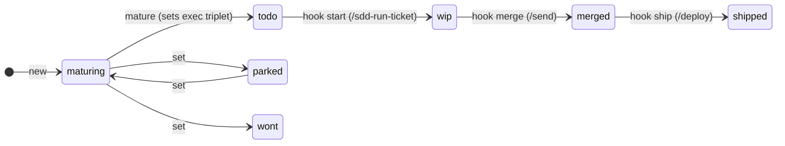

# backlog-as-data

**A spec-driven backlog and agent-orchestration system for Claude Code, where the
backlog is git data — not a document.**

> **What this is (and is not).** This repo is the extraction of a personal system
> that runs daily on real projects. It is published as a **reference
> implementation** — read it, steal ideas from it, adapt pieces of it. It is
> **not a supported product**: no installer, no roadmap, no issue triage promised.
> The README explains every concept in English; the CLI source and the skill
> prompts are published verbatim from the working system (skills translated to
> English, code comments still in French — the design rationale they carry is
> covered below).
>
> **Snapshot taken 2026-08-31.** The system it is extracted from keeps moving;
> this repo is refreshed by hand, in batches, not on every commit.

---

## TL;DR

Most agent task-management tools store tasks in a dedicated place (a `tasks.json`,
a database, a `backlog/` folder). This system makes a different bet:

**The backlog *is* the YAML frontmatter of your spec files.** One file per ticket
in `specs/`, `type: ticket` in the frontmatter, and the ticket's status is a
**field** — never a location in a document. Everything else (`backlog.json` for a
web board, `specs/backlog.md` for humans reading git) is a generated projection,
locked by a sentinel and regenerated by every mutation.

On top of that data model sit four ideas that, as far as I can tell, no
published tool combines (see [Comparison](#comparison-with-existing-tools)):

- **[Maturation with a per-ticket execution triplet](#maturation-dosing-model--effort--review-per-ticket)** —
  deciding to do a ticket and deciding *how hard to think about it* are separate
  acts. Maturing a ticket means fixing `model` / `effort` / `review` **before**
  any agent runs.
- **[Lifecycle hooks tied to the git flow](#lifecycle-hooks-tied-to-the-git-flow)** —
  `todo → wip → merged → shipped` is applied by hooks attached to the run /
  integrate / deploy commands, keyed on conventional commits
  (`feat(TICKET-ID): …`). Nobody moves the back half of the lifecycle by hand —
  a manual `set` remains an explicit, visible correction, never routine.
- **[A review gate held by the orchestrator, with fresh-context reviewers](#the-review-gate-fresh-context-reviewers-orchestrator-held-evidence)** —
  the implementing agent never spawns, briefs, or even knows about its
  reviewers. The evidence of review (reviewer count, `git status`, the review
  register) is produced by the orchestrator, never by the entity it audits.
- **[Commitment and lifecycle as orthogonal axes](#the-state-model-two-orthogonal-axes)** —
  MoSCoW priority answers "did we choose to do this?"; the lifecycle answers
  "where is it in the pipeline?". Conflating them is the most common failure
  mode I saw in LLM-managed backlogs.

Those four are the data model and the pipeline over it. The fifth thing, which
an earlier version of this README listed as an unsolved problem, is
[the loop that feeds the skill](#the-loop-that-feeds-the-skill-this-section-used-to-be-the-open-problem):
friction gets captured raw, mined for what actually repeats, and routed into
whichever mechanism already owns it — with the human kept as the filter on
purpose.

## Why

This came out of running Claude Code daily on a solo project with many parallel
agent sessions. Markdown to-do documents kept failing in the same ways:

- **"Move it to Done" is not an operation** — LLMs (and humans) mangle documents
  when a state change means relocating text. Making status a field makes every
  transition a one-line, idempotent, testable mutation.
- **Two sources of truth always diverge.** If the board and the specs are edited
  independently, they drift. Here the specs' frontmatter is canonical; the board
  and the readable view are projections with a coherence test (regenerate, then
  fail if git sees a diff).
- **Parallel agents stomp on shared documents.** With one file per ticket and
  hooks that commit only the files they actually touched, parallel sessions
  stopped colliding on the backlog.
- **A backlog managed *by* agents needs machine-checkable invariants**, not
  conventions. The invariants live in a Zod schema and a hand-rolled, bounded
  YAML-subset parser (round-trip-safe, CRLF-tolerant), enforced by every CLI
  entry point.

### The stance behind it: code as a black box

A personal disclosure, because it explains most of the design. I'm a scrum
master; I was a developer ten years ago. I have enough background to discuss
design and trade-offs with an LLM — but with SDD I made a deliberate choice to
treat the code as a **black box, controlled by tests**. The specs define the
tests; the tests control the code; **I never read the code.**

That is my own bet, and only mine — I am not claiming it is what everyone
should do. But it is what forced this system into existence: when nobody reads
the code, the process has to carry the trust that a code-reading human would
normally provide. Hence machine-checkable invariants everywhere, hence a
review gate that is fully automated (fresh-context reviewers instead of my
eyes), and hence its role: not a ceremony that certifies quality, but a lean
mechanism — catch the misses as early as possible, at the lowest possible
cost. The dosage (`review: none|light|deep`, decided at maturation) is exactly
that lean calibration: pay for defect detection in proportion to the cost of a
defect slipping through.

## The data model

A ticket is a markdown file in `specs/` whose frontmatter carries the state:

```markdown
---
id: ANALYTICS-02
title: Batch-compute cast rates when null
type: ticket
status: todo
priority: should
epic: analytics
exec:
  model: sonnet
  effort: medium
  review: light
  matured: 2026-06-12
---

# ANALYTICS-02 — Batch-compute cast rates when null

The spec body. Design, contracts, test cases. The ticket file IS the spec —
or points to a domain spec that is.
```

Everything below the frontmatter is the spec: free prose. It could be written
by anyone — here it is written **by the LLM**: I express a need in
conversation, the agent challenges it, and once we agree, the agent writes the
spec (see [How a ticket flows](#how-a-ticket-flows-end-to-end)). The
frontmatter is data: owned by the CLI, mutated only through it. That split is
the whole trick — spec-writing stays a writing activity (a conversational one,
in my case), backlog management becomes data manipulation, and they live in
the same file so they can never drift apart.

Mutations go through a CLI (bundled to a single self-contained `.mjs`, installed
once in `~/.claude/tools/backlog/`, operating on whatever project `cwd` is in).
Note that the CLI is **agent-facing**: in practice the human never types these
commands — they state intents in conversation, and the agent maps them to
exactly one CLI verb (see [How a ticket flows](#how-a-ticket-flows-end-to-end)):

```
backlog new ANALYTICS-02 --epic analytics --priority should   # creates in `maturing`
backlog mature ANALYTICS-02 --model sonnet --effort medium --review light --date 2026-06-12
backlog set ANALYTICS-02 status=parked                         # explicit correction only
backlog snapshot                                               # regenerate projections
backlog list                                                   # terminal view, no web board needed
backlog init                                                   # adopt on any project: .gitattributes + empty backlog.json + specs/
```

Every mutation regenerates **both** projections in the same gesture:
`backlog.json` and `specs/backlog.md` (readable in git). This is what
projections are *for*: in my setup, a small web board on my server renders
`backlog.json` to visualize the backlog, and since every ticket carries its
`file` path, clicking a card opens GitHub directly on the spec. The board
needs zero write access — it is a pure view over git data, and any other view
(the `backlog list` terminal command, the generated markdown) is just another
projection of the same frontmatter.

The generated view opens with a sentinel comment — `DO NOT EDIT BY HAND` —
and the renderer **refuses to overwrite a file that lacks the sentinel**, so a
legacy hand-written backlog restored by a bad merge can never be silently
clobbered, and a hand-edit is flagged instead of being overwritten in silence.

### The state model: two orthogonal axes


```mermaid
stateDiagram-v2
    direction LR
    [*] --> maturing : new
    maturing --> todo : mature (sets exec triplet)
    todo --> wip : hook start (/sdd-run-ticket)
    wip --> merged : hook merge (/send)
    merged --> shipped : hook ship (/deploy)
    maturing --> parked : set
    parked --> maturing : set
    maturing --> wont : set
```

- **Axis 1 — Commitment**: `priority: must|should|could` (we chose to do it) ·
  `status: parked` (still deciding) · `status: wont` (decided against).
- **Axis 2 — Lifecycle**: `maturing → todo → wip → merged → shipped`.

The two axes are orthogonal, and the distinction that LLMs get wrong most often
is: **"not yet matured" ≠ "parked"**. A ticket you *know* you want but haven't
sized yet is `maturing` + a priority — not `parked`. I saw this conflation
repeatedly before making it an explicit rule.

The invariant tying the axes together: the `exec` block is **required** for
`todo/wip/merged`, **optional** for `shipped` (historical tickets migrated
without traced maturation), **forbidden** otherwise. Setting a matured ticket
back to `parked` removes `exec` automatically ("dematuration") — otherwise `set`
would be a dead end for matured tickets.

## The ideas in detail

### The backlog is git data

Covered above, but three design points are worth stealing on their own:

- **Status is a field, never a location.** There is no "Done section". The
  readable view groups by status, but it's generated — nobody edits it.
- **Projections are locked and tested.** A coherence test regenerates the
  snapshot and fails if git sees a diff. Stale projections can't survive a
  `/send` (integration) because the test runs in its guard step.
- **The parser is deliberately tiny.** A bounded YAML subset: top-level scalars,
  one nesting level (the `exec:` block), comma-separated scalars for lists, no
  multi-line values — free text belongs in the body, never the frontmatter.
  Small enough to be round-trip-safe and CRLF-proof, which is what lets the
  serializer rewrite files without ever mangling a spec.
- **Ticket ids are allocated against `main`, not the current worktree.** Since
  every conversation lives in its own worktree, an id that looks free locally
  may already be shipped on main (the branch forked before it landed). So
  `backlog new` also reads the ids present on the integration branch
  (`git ls-tree main:specs`, read-only, never fatal) and refuses a taken id
  with a suggestion for the next free one — always *beyond the highest taken*,
  never reusing a gap: history may already carry a `feat(SCOPE-41): …` for
  something else, and gaps are free. The residual race (two parallel sessions
  grabbing the same number between two syncs) surfaces as an add/add conflict
  at merge, and the LLM resolves it there by renumbering its own ticket.

### Maturing a spec: five checks before a clause gets written

"Maturing" a ticket covers two different acts that share a name. One is dosing
the triplet, below. The other is writing the spec — deciding what the ticket
actually prescribes — and that is where an LLM writing specs fails, in a way that
turned out to be repetitive enough to write down. The failures all have the same
shape: **the spec is confident about a repository it did not open.** Five checks,
applied before a clause is written:

1. **Grep the name, not only the carriers you know about.** Search the whole repo
   for the name of the thing the ticket changes — function, constant, path, a
   prescriptive sentence — comments and test fixtures included. A carrier you did
   not grep is a carrier you did not see.
2. **Follow the side effect of the gesture you are prescribing.** For each one:
   what references the thing I am inserting, moving, or deleting? Inserting
   shifts line numbers. Moving a comment widens the scope of what it asserts.
   Deleting a site makes everything citing it stale.
3. **Enumerate the branches of the mechanism you touch.** A scope that touches a
   predicate, a dosage, or a state machine has to say what it does with *every*
   case — not only the one that motivated the ticket.
4. **Read your own clauses against each other.** Never write "X is unchanged"
   without checking that the prescribed gesture does not touch X. A
   non-regression clause *enumerates* the cases that stay green and *names* the
   ones this ticket invalidates. "All of them, untouched" is not a clause, it is
   a hope.
5. **Open the repository the spec targets.** What a clause prescribes *in* a repo
   is verified *in* that repo, before being written: a command it cites exists in
   that project's manifest **and** is permitted by that project's rules — "the
   script exists" is not "the script is allowed"; a file it promises to deliver
   is actually tracked by git; a path it names exists. In cross-repo work this is
   the normal case, not the edge case: the spec is written from a session open
   somewhere else.

### Maturation: dosing model / effort / review per ticket

`backlog mature` is the moment a ticket becomes runnable, and it forces three
decisions *as data*:

| Field | Values | What it doses |
|---|---|---|
| `model` | `opus` · `sonnet` (· `fable`) | Which model implements the ticket |
| `effort` | `low` · `medium` · `high` · `xhigh` · `max` | The sub-agent's **actual** reasoning tier |
| `review` | `none` · `light` · `deep` | The review gate: 0, 1, or 3 fresh-context reviewers |

`effort` is not a word in a prompt. The harness has no effort parameter on the
spawn call, so the only mechanical lever is the `effort:` field of an agent
definition — the runner keeps one agent-def per tier (`sdd-impl-low` …
`sdd-impl-max`) and selects it from this field, overriding only the model per
call. The prompt still states the tier as well, as a backstop; the agent-def is
what actually moves the dial.

Why this matters: agent runs have a per-ticket cost/quality trade-off, and the
right place to decide it is **at planning time, deliberately** — not at launch
time, implicitly, by whoever happens to type the command. A trivial rename gets
`sonnet / low / none`. An irreversible data migration gets `opus / max / deep`.
The decision is versioned with the ticket and auditable after the fact
(`matured: <date>`).

Three hard-won rules ride along:

- **`review` absent = `light`, and the default lives in the consumer** — the
  runner applies it; the CLI never writes a default into the frontmatter. Data
  records decisions; defaults are behavior.
- **I rejected a mandatory `--review-why` justification.** Asking a model to
  justify its dosing produces post-hoc rationalization, not deliberation. On a
  real ticket, the maturing agent chose `deep` and was right, while a
  second opinion argued `light` and was wrong — a written justification would
  not have distinguished them. Criterion that actually works: *if this defect
  slipped through, would anything else catch it?* No test would catch it, or
  publicly visible → `deep`. Will explode on next use anyway → `light`.
- **The triplet has a floor, checked by the tool: `high`/`xhigh`/`max` require
  at least `opus`.** A high reasoning tier on a cheap model is the combination
  that produces confident nonsense, so `mature` refuses it. It is a *floor*,
  not a pairing — `opus` on a `low` effort is never questioned, and `low`/
  `medium` have no floor at all. Overriding it is `--override-coherence`: a
  **gesture, not a written justification**, for exactly the reason
  `--review-why` was rejected above. `fable` is an accepted value but is
  classified nowhere in the scale, so it is *refused* above the floor rather
  than presumed above it.

One migration note, because it is the reason this renaming cost nothing. Both
vocabularies changed after the system was already in daily use: `haiku` was
dropped from the scale (zero observed use, and anything
trivial enough for it is already safe on `sonnet`), and the old effort names
were renamed to the harness's real tiers. The parser is **tolerant on
read, strict on write**: a historical ticket carrying `effort: think-hard` still
loads and is normalized to `high` in the projection, while `mature` refuses to
*write* a legacy value. So the tickets already on disk were never rewritten —
and `backlog.json` nonetheless contains only official values.

### Lifecycle hooks tied to the git flow

The back half of the lifecycle (`wip → merged → shipped`) is **never set by
hand**. Three workflow commands each fire a hook:

| Command | Hook | Transition |
|---|---|---|
| `/sdd-run-ticket X` (launch an implementer) | `hook start X` | `todo → wip`, for that id only |
| `/send` (rebase + fast-forward into main) | `hook merge` | every `wip` whose `feat(ID):`/`fix(ID):` commit is **actually on the integration branch** → `merged` |
| `/deploy` (verify + push to prod) | `hook ship` | every `merged` → `shipped` (a deploy pushes all of main) |

Design decisions that took incidents to learn:

- **`merge` promotes only tickets whose implementation commit is on the
  branch** — read from commit *subjects*, only `feat(...)`/`fix(...)`
  conventional scopes. Body mentions and `chore(backlog): start X` commits used
  to cause premature promotions.
- **Hooks always exit 0.** A project without a backlog, an unknown event, a
  failed transition — all warnings, never failures. Lifecycle automation must
  never block integration or deployment.
- **Hook commits are surgical.** The main checkout is shared by many parallel
  sessions. `git add specs/` would sweep up a neighbor session's in-progress
  ticket (this happened — 2026-07-17). Hooks commit **only the files of tickets
  they actually transitioned**, with `git commit --only -- <paths>`.
- **Chained hooks mean a ticket coded outside the pipeline stays `todo`** — the
  merge hook only promotes `wip`. That's a feature: the manual `set` correction
  is legitimate then, and visible as such.

### The review gate: fresh-context reviewers, orchestrator-held evidence

`/sdd-run-ticket` runs the full loop for one ticket: preflight guards →
implementer sub-agent in an isolated git worktree → review gate → findings sent
back → integration. The gate design is the part I have not seen elsewhere:

- **Reviewers arrive with a blank context.** They get the ticket id, the spec
  path, the worktree path, the commit SHA, and four review axes — *nothing
  else*. No summary of what the implementer did, no justification of choices, no
  hints of where to look. Contaminating the reviewer's context is the main
  vector for confirmation bias, so the reviewer prompt is a frozen template
  where only mechanical values are substituted.
- **The orchestrator, not the implementer, holds the evidence.** The implementer
  never knows the review dosage, never sees the reviewer prompt, and cannot
  attest to anything about the review. The orchestrator constates `git status
  --porcelain` before and after the review (reviewers keep write tools
  technically — the read-only rule is declarative, so the check is the real
  guarantee), reads the SHA programmatically (a hand-transcribed SHA once
  arrived with 39 characters and broke the reviewer's location assertion), and
  publishes a **review register**: findings in, dispositions out, one line per
  unique finding, with a mechanical completeness check.
- **Findings have exactly two exits: fixed, or escalated with justification.**
  The implementer triages every finding into fix, or one of three closed
  escapes — E1 (fix requires changing the spec), E2 (pre-existing debt → open a
  ticket via the CLI), E3 (fix breaks an existing green test). No silent
  dismissal: "not a big deal" is not a disposition. E2 has its own trap,
  documented after a real miss: pre-existing-ness is tested on *"would the
  defect exist if my ticket had never shipped?"*, never on *"is the file inside
  my diff?"* — stale docs about your new flag are in scope even though the doc
  file is old.
- **Reviewers report findings-only, no praise.** A report that says "everything
  else conforms" manufactures false confidence — it once accompanied a report
  that declared conformant the very decisions it was missing a defect in. And
  "0 findings + remarks in prose" is a contradiction: an off-format remark *is*
  a finding someone filtered.
- **The review runs at a fixed setting, not the session's.** Reviewers are
  spawned through a dedicated agent definition pinned to a strong model and a
  high reasoning tier, and the spawn passes **no** model parameter. Before that,
  a reviewer inherited whatever the orchestrating session happened to be running
  — so the same `deep` dosage bought a strong review or a weak one depending on
  a setting nobody was thinking about at that moment. The *number* of reviewers
  stays a per-ticket dosage; their **power** stopped being one.
- **One round.** After dispositions, no second wave of reviewers. Review gates
  that loop become polishing loops.

Dosage recap: `none` — no gate; `light` (default) — 1 reviewer, all four axes;
`deep` — 3 reviewers in parallel, each with **all four axes** plus a different
priority lens. Axes are never partitioned: on a real `deep` run, no reviewer
stayed in its lane and the most lane-disciplined reviewer found the *least*.
`deep` buys three decorrelated samples of the same diff, not three complementary
coverages.

Decorrelation is protected mechanically, not just intended. At `deep` each
reviewer writes to its **own** report file, outside any repository — never a
shared one, because with a shared file a reviewer would read another's findings
and the independence that is the entire value of the dosage would be gone. And
each run computes a **fresh** suffix for those paths, so that re-running the
gate on the same ticket after an abort cannot have a reviewer pick up a stale
report from the previous attempt.

Three samples of the same diff overlap, so `deep` adds a fourth sub-agent: an
**aggregator** that never reads code. It gets the three raw report files and
returns one deduplicated list, renumbered from 1, each entry copied verbatim
from one of its sources — never rephrased. Two rules make it worth its cost:

- **It is blind to provenance.** It is not told which reviewer wrote which
  report, nor which lens each had. It cannot weight a finding by its author,
  because it does not know the author.
- **The deduplicated list carries no attribution either** — not the reviewer,
  not the dosage, and above all **not how many of the three reported it**. That
  count exists, in a separate correspondence table mapping every raw finding to
  the unique it landed on; but that table goes to the orchestrator, not to the
  implementer. The implementer must not get to reason "only one of three flagged
  this, so it is probably noise" — that is exactly the silent dismissal the
  disposition rule forbids. The table's real job is arithmetic: its row count
  must equal the sum of the three reports' totals, which is how the orchestrator
  proves nothing was lost in the merge.

### An escalation is a row, not a remark

The gate produces two kinds of residue. Fixed findings leave a commit. Escalated
ones used to leave *nothing*: the register was published in conversation and died
with the session, so "someone must arbitrate this" survived only as long as the
operator remembered it.

E1 in particular deserves better than that. It means *the "what" has to change* —
so its most frequent object is a defect **in the spec itself**, found by a
reviewer who read the code against a contract that turned out to be wrong. The
implementer cannot fix it: it is forbidden to touch the spec, and that
prohibition is the whole reason the review has a fixed contract to judge against.

So the orchestrator writes it down, in the ticket's own spec file:

- **In the body, never the frontmatter.** The frontmatter is mutated exclusively
  by the CLI; an escalation is prose. It gets appended under a single
  `## Escalations` container, one level-3 heading per escalation.
- **The heading is a machine contract.** Its title must *start* with the tag
  (`E1`, `E3`, `E1/E3`, optionally suffixed — `E1 (finding 2)`). That is not
  decoration: a `backlog escalations` verb scans every spec in the project and
  lists the open ones. The system does not leave that recognition to inference —
  the repo that *produces* escalations guarantees the shape the reader expects.
- **A separate commit** — `docs(TICKET-ID): escalation E1`, never folded into the
  code commit that went through the gate. What was not reviewed stays visible as
  not-reviewed.
- **The orchestrator does not arbitrate; it makes arbitration possible.** The
  required content is what a human needs in order to decide: what the gate found
  and what makes it true (file, line, quote), why the implementer could not fix
  it, and the possible ways out — explicitly *not* ranked.

Closing one is `escalations close <ID> --by <ID> --date …`, which inserts a
marker — and **only that marker counts**. An escalation "closed" by editing its
title in prose is not recognized and stays listed as open. That is a deliberate
consequence, not an oversight: a state a machine reports must have exactly one
writer, or the report becomes a matter of interpretation.

Two details are there because the alternative was silent loss. A heading inside
the container that does *not* start with the grammar but nonetheless contains an
`E1`/`E3` token looks far more like a mistyped escalation than like prose — so it
is reported on stderr, with its file and line, and never listed as an escalation.
And the reader accepts the older pre-container shape too, because escalations
written before the convention existed are exactly the ones nobody would think to
go looking for.

What this changes in practice: at the end of a cycle the operator gets a *list*,
not a memory. And because an escalation names the ticket whose spec it lives in,
the arbitration lands where the work is.

## Who does what: scripts attest, the LLM judges, sub-agents generate

Mapping the whole pipeline by *who performs each step* reveals the system's
quiet design rule. Every step is one of three kinds:

- **Deterministic scripts** — the preflight resolver (`resolve`/`locate`), the
  lifecycle hooks, git operations, coherence tests. They emit JSON or exit
  codes; they are the only producers of **evidence** (the commit SHA, the
  `git status` proofs, the backlog statuses). *Attestation is always produced
  by a script, never by the entity it controls.*
- **LLM judgment (orchestrator)** — scope arbitration, spec writing,
  dependency confirmation, writing the review register, writing escalations
  into the spec. Things that genuinely require judgment, kept in conversation.
- **LLM generation (sub-agents)** — the implementer, the reviewers, and the
  aggregator. The generative work, behind guards on both sides. Merging
  duplicate findings used to sit in the bullet above, as orchestrator judgment;
  it moved here once it got its own blind sub-agent, which is a better place
  for it — the orchestrator now *checks* the merge (the row count) instead of
  performing it.

The design trajectory follows from incidents: **every time a mechanical step
lived as prose instructions executed by the LLM, it eventually failed** — a
tilde not expanded, an `awk` positional field eaten by placeholder
substitution, a SHA hand-transcribed to 39 characters. Each of those steps was
moved out of prose into a deterministic tool that the skill calls once and
reads JSON from. Prose is for judgment; mechanics get a script. The guards are
the same story in decision form: every checkpoint is **fail-closed** (ticket
not found, maturation not on main, dirty tree, SHA mismatch → STOP), so the
pipeline stops rather than drift into "everything works, but in the wrong
tree".

The most recent application of that rule is measurement. The review register is
published in conversation and dies with the session, so a writer script now
persists its durable part: one JSON file per ticket cycle, in a separate data
repo — dosage, reviewer count, raw and unique finding counts, and each finding's
disposition with the SHA that fixed it or the ticket that inherited it. The split
is the same one as everywhere else. What the orchestrator *decided*, it passes as
arguments; what can be *observed* — token counts, the run's rank in the session —
the writer reads from the transcript, and the orchestrator is not allowed to
declare it. Two consequences fell out of that. The command has to be run by the
orchestrator from its own shell, because a sub-agent running it would measure
**its own** transcript — a different quantity, silently. And a finding's fix SHA
is recorded before integration rebases it, so the writer itself checks whether
that SHA is still reachable from the branch, rather than trusting the number it
was handed.

One rule of the register carried over into the file, and it is the one worth
stealing: at dosage `none`, the finding counts are **omitted, not zeroed**.
Nobody looked, so `0 findings` would be manufactured evidence — and a row of
zeroes is indistinguishable, later, from a review that ran and found nothing.

## The skill became a program, and it has a size budget

The orchestration skill is around 95 KB of markdown. At that size it is no longer
prose with a few commands in it — it is a program, and it acquired the two things
programs need: modules, and a budget.

The modules are split by **who reads them**, which turned out to be the only
distinction that matters:

| Family | Reader | When |
|---|---|---|
| the skill file | the orchestrator | always |
| `prompts/*.md` | the **sub-agents themselves** | at the start of their own run |
| `steps/*.md` | the orchestrator | conditionally — the cross-repo branch, the aggregation body at dosage `deep` |

`prompts/` is the interesting one, because it changed a guarantee rather than a
layout. The reviewer's manual — its location assertion, its prohibitions, the
four review axes, its output format — used to be *injected*: the skill held the
text, and the orchestrator copied it into the spawn prompt. Now the spawn prompt
carries only variables and a pointer, and the sub-agent resolves the path and
reads the manual itself before doing anything else (and stops, loudly, if it
cannot read it). The axes stopped being a transcription and became invariants of
a file. No reviewer can be handed three axes out of four because a copy got
tired.

It also makes a hot-swap possible that the injected version could not: an edit to
a manual takes effect on the **next** launch, including for sub-agents working in
a completely different repository — and never on an agent already in flight.

The budget is a byte ceiling per family, asserted by a test. Nothing forbids
growth: raising a ceiling is a **one-line edit, in the commit that grew the
file**, visible in the diff. That is the entire mechanism, and the details are
where the intent lives:

- The ceilings sit in their own dedicated test file, precisely so that raising
  one is a one-line edit rather than surgery in the middle of a large shared
  test file. Several tickets that write into the skill each contradict the
  ceiling and each have to re-measure it in their own commit. That is the
  designed behavior, not friction to be smoothed away.
- **A ceiling is an observation, not a target.** No reduction percentage is
  promised, and the point was never to make the skill small. The point is that
  growing it is a deliberate, reviewable act instead of a silent one — which is
  what a modular split alone does *not* give you: without the ceiling, the skill
  could re-absorb every byte that had just been extracted into `prompts/`, by
  plain copy-paste, without a single test moving.
- The fourth ceiling is on the global `CLAUDE.md`, and it is singled out by its
  reader too: the harness loads that file on **every** session of **every**
  project, and injects it into the context of every sub-agent spawned. The other
  three cost something only inside a cycle. This one costs something always.

## How a ticket flows (end to end)

The division of labor matters: **the human never runs the CLI, never writes
frontmatter, and never edits the spec files directly**. You steer in
conversation; the agent does all the mechanics through the CLI (that is what
makes the mutations deterministic — the agent has no hand-editing path). A
typical cycle, as it actually happens:

```
you        open a conversation on a fresh worktree:
           "we should handle X" — one ticket, or an epic to slice
you+agent  discussion until the need is agreed — requirements elicitation
           happens in chat, not in the spec file
agent      once agreed, records it:
             backlog new PARSE-07 --priority should      # status: maturing
           and writes the spec body (design, contracts, test list)
           from the conversation
you        "mature it, then run it"
agent      backlog mature PARSE-07 --model sonnet --effort medium \
             --review light --date 2026-07-22            # status: todo
           (the triplet is a maturation decision — the agent asks you
           for the review dosage rather than choosing in your place)
           …maturation committed and integrated into main: the implementer's
           worktree forks from main, so an unmerged maturation is invisible
           to it — a preflight guard blocks the launch until it is there
agent      /sdd-run-ticket PARSE-07
  hook       start → wip  (committed on main, scoped to this ticket's files)
  subagent   implementer sub-agent spawned in an isolated worktree forked
             from main — running THE model decided at maturation, nothing
             else: the orchestrator copies `model`/`effort` from the
             frontmatter, it does not choose, and the sub-agent's report
             must open with `Model used: …` so the decision is verifiable
             after the fact. SDD discipline: spec → failing tests → code →
             green verification → ONE commit `feat(PARSE-07): …` → report,
             then STOPS (never integrates itself)
  gate       dosage read from the frontmatter: `none` → no gate, straight
             to integration · `light` → 1 reviewer · `deep` → 3 in
             parallel, then 1 blind aggregator over their reports.
             Reviewers are FRESH sub-agents at a pinned setting, never
             the session's: blank context — ticket id, spec path,
             worktree, SHA, and a pointer to the manual they read
             themselves (all four axes each, always; `deep` adds a
             different priority lens per reviewer, never a subset).
             The orchestrator locates worktree+SHA programmatically,
             collects the reviewers' reports, checks git status unchanged —
             then resumes THE IMPLEMENTER with the raw findings, verbatim:
             the implementer (context intact) triages E1/E2/E3 and fixes;
             the orchestrator never touches the code. It closes by
             verifying the fix commits exist and publishing the register
  residue    any E1/E3 escalation is APPENDED to the ticket's spec in its
             own `docs(PARSE-07): escalation` commit, tag-prefixed so the
             CLI can list it later — arbitration outlives the session.
             A per-cycle measurement file is written outside the repo
agent      /send   (run by the orchestrator from the implementer's worktree)
  hook       merge → merged  (PARSE-07's feat commit is on main)
you        "deploy"
agent      /deploy
  hook       ship → shipped  (pushed to prod in the same push)
```

The human's three touchpoints are all decisions, never mechanics: agreeing on
the need, choosing to mature-and-run (with the review dosage), and deciding to
deploy. Everything between two touchpoints is the agent's. A cycle can leave one
decision *behind* it — an escalation — but that one is deliberately not a
touchpoint: it does not block the cycle, it waits in the spec until someone runs
the verb that lists it.

The implementer also has standing orders worth stealing: never touch the
backlog artifacts (`wip`/`merged`/`shipped` come from hooks keyed on its commit
scope), never invoke integration/deploy commands itself, verify its isolated
worktree before writing (shell `cd` and file-tool sandboxes can disagree), and
rebase onto live `main` first (worktrees fork from the session's start
commit).

## What's in this repo

| Path | What | State |
|---|---|---|
| [`skills/sdd-run-ticket.md`](skills/sdd-run-ticket.md) | The full orchestration skill: preflight, launch, review gate, register, integration | English translation |
| [`skills/send.md`](skills/send.md) | Integration skill: coherence guards → rebase → fast-forward → `hook merge` (+ `hook ship` on no-deploy projects) | English translation |
| [`skills/deploy.md`](skills/deploy.md) | Deploy skill: typecheck → migrations check → tests → E2E → `hook ship` → push | English translation |
| [`skills/backlog.md`](skills/backlog.md) | Conversational wrapper mapping intents to CLI verbs | English translation |
| [`prompts/`](prompts/) | The **sub-agents'** manuals, which they read themselves: implementer (same-repo and cross-repo), reviewer, aggregator | English translation |
| [`steps/`](steps/) | Sections of the orchestration skill read **conditionally** by the orchestrator: the cross-repo branch, the `deep` aggregation body | English translation |
| [`cli/`](cli/) | The CLI source (TypeScript): frontmatter schema+parser, snapshot projection, markdown renderer, lifecycle hook core, escalation reader, command dispatch | Verbatim (French comments) |
| [`tools/preflight.mjs`](tools/preflight.mjs) | Deterministic preflight resolver used by `/sdd-run-ticket` (ticket lookup, mode, worktree derivation, guards) | Verbatim |
| [`examples/`](examples/) | A sample ticket file and generated projections | Synthetic |

The split between `prompts/` and `steps/` is the one described in
[The skill became a program](#the-skill-became-a-program-and-it-has-a-size-budget):
they are separated by **who reads them**, not by topic.

The skills are Claude Code slash commands (`~/.claude/commands/*.md`); the CLI
is bundled (esbuild) into a single `backlog.mjs` installed under
`~/.claude/tools/backlog/` and invoked by the skills through `$HOME` resolution.
The only runtime dependency of the CLI source is `zod`.

**Where the code actually lives.** When this repo was first extracted, the CLI
was a folder inside the application project that happened to be its first user,
and its tests leaned on that project's runner config. It has since moved out
into its own repository, which is now the canonical source: the bundle at
`~/.claude/tools/backlog/backlog.mjs` is a build artifact of it, and the copy
under [`cli/`](cli/) here is an extraction *of that repo*, not of an application.
The test suite (parser round-trip, snapshot determinism, hook planning K1-K6,
CLI dispatch, escalation parsing) moved with it and is larger than the source it
covers; it is not duplicated here, but it is no longer stuck in someone else's
project either.

## Scar tissue (incidents that shaped the design)

Most rules above exist because something broke. A sample, kept in the skills as
warnings so agents re-read them at the point of failure:

- **A `git push origin main` from a worktree pushes the parent repo's local
  `main`, not your HEAD** — the push "succeeds" while silently pushing something
  else. Every push in the system is `git push origin HEAD:main` (incident
  2026-06-22: two commits silently excluded, CI red).
- **Never junction/symlink `node_modules` into a worktree** — the harness's
  `git worktree remove` descends into the junction and empties the *real*
  `node_modules` of the main checkout.
- **`$`-digit sequences in skill files get eaten by placeholder substitution**
  — an `awk '{print $1}'` in a skill arrives at the agent as `awk '{print }'`,
  silently selecting the wrong directory. The skills use `sed` instead, and
  document why so nobody "simplifies" it back.
- **A shared main checkout means every automated commit must name its paths** —
  `git add -A` + bare `git commit` swept a neighbor session's in-progress work
  into a bookkeeping commit (2026-07-17). Hence `--only` + explicit paths
  everywhere.
- **An agent's "completed" report is not evidence** — verify the
  `feat(ID):` commit is actually on main before believing it; a sub-agent once
  reported success with no commit at all.
- **Fixed-name probe files collide under parallelism** — the worktree-detection
  probe is suffixed with the ticket id, or parallel agents lock each other's
  worktrees.
- **Under Git Bash on Windows, an argument starting with `/` is rewritten into a
  Windows path before the program ever sees it** — and quoting does not help,
  because the rewrite happens outside the quotes' reach. Setting a ticket title
  that began with a slash stored a mangled value and exited 0. The fix is an
  environment variable (`MSYS_NO_PATHCONV=1`), and the lesson generalized: it is
  prescribed once as a preamble for *every* verb taking a free-form value, not
  just for the one verb that got bitten.
- **Rewording the generated-file sentinel froze every existing view.** The lock
  recognized generated files by the sentinel's exact wording, so when a ticket
  reworded it with no read compatibility, every previously generated view stopped
  being recognized — and the lock, doing exactly its job, refused to regenerate a
  file it did not recognize. The matcher is now **structural** (a leading HTML
  comment of the right shape, any wording): a stale view re-stamps itself at the
  next mutation instead of freezing, while a genuinely hand-written legacy
  backlog — no leading comment at all — stays protected. Both halves of the
  lock's job survive, which is the part a naive fix would have lost.
- **A finding title is untrusted input to your own shell.** The metrics writer
  takes each finding's short title as an argument, and those titles are copied
  from reviewer reports, which quote code in backticks — nearly half of the real
  ones contain at least one. Passed inside double quotes, the shell substitutes
  the backquote and `$(…)`: the title arrives truncated, silently, exit 0, file
  written — and a title quoting a command would have *run* that command in the
  orchestrator's shell. Single quotes, everywhere, with one documented exception
  for the apostrophe.
- **A guard that did not run is not a guard that passed — nor one that failed.**
  The integration command detects its structural tests with a file glob and runs
  them with a name filter: two distinct mechanisms, and they can diverge. A repo
  where the glob matches a file that the runner's own config excludes gets an
  empty selection — the glob saw it on disk, the filter never played it. That
  used to exit non-zero and stop the integration, reporting an incoherence that
  nothing had actually observed. The command now has **three** outcomes instead
  of two: green, red, and *empty selection* — which is reported in one line,
  naming the files seen and not played, and then continues.

That last one is the same rule the review gate applies twice elsewhere, and it is
probably the single most transferable idea in this section: **never let an
absence of measurement render as a measurement.** At dosage `none` the finding
counts are omitted rather than zeroed, because `0` would claim someone looked. An
empty reviewer report accompanied by prose remarks is a contradiction to be
resolved rather than averaged. And an escalation "closed" by editing its title in
prose stays listed as open, because the closure marker is the only writer the
reader recognizes. Different mechanisms, one discipline: a system that reports
states must never be able to say something it did not observe.

One of these hardened into a general rule for every sub-agent, and it is
reproduced in all four manuals: **a tool call refused by the harness (a
permission, a hook, a classifier) is a stop, not an obstacle.** It is carefully
distinguished from an *error* — a wrong path, a missing argument, an unfound
`old_string` — which should be fixed and replayed. What is refused is the
**intended effect**, not its phrasing: so do not replay the same effect through a
different tool, do not rephrase it to make it acceptable, do not split it into
pieces none of which trip the refusal, and do not defer it. What remains allowed
is to give up that specific effect and continue, or to stop entirely — and either
way to say so plainly in the report, even if that means abandoning the required
output format. A refusal silently worked around by dropping it stays invisible,
which is the failure this rule exists to prevent.

## The loop that feeds the skill (this section used to be the open problem)

Everything in the section above got into the skill the same way: an incident
happened, and the operator wrote the lesson back into the skill **at the point
of failure**, so the next agent re-reads it exactly where it is about to make
the mistake. That retrospective loop is the system's real engine — and an
earlier version of this README said it was **nowhere in the system**, living
only in the operator's habits (a scrum master's reflex: no incident without a
retro).

It has since been built, in the shape that section guessed at: encode the
*trigger*, keep the human as the filter. Three pieces.

**A capture tier.** Durable memory has four kinds of distilled fact; a fifth was
added, `candidate` — *raw* friction, not yet a rule. One line, written at the end
of a chunk of work: what struggled, what the user corrected, what a guard caught.
Capture is deliberately cheap and low-threshold, because capture is not judgment;
a candidate is explicitly ephemeral and lives until the next mining pass. Each
one is tagged with a scope, which matters more than it looks — see below.

**A miner, `/reflect`.** Its framing was itself matured in conversation, and the
framing *is* the design. It does not look for "an improvement" — unbounded, and
the output turns to mush. It looks for **a friction that repeats and does not yet
have a rule**. And it is a **router**, not a brain: it dispatches what recurs to a
home that already exists, picking a row in a table rather than inventing a
destination:

| Recurring friction about… | Home | Proposed action |
|---|---|---|
| **behavior** — the user keeps correcting the same thing | durable memory | promote it to a `feedback`/`project` fact |
| **one specific skill** | a `SKILL-NN` ticket | open the ticket, or propose running `/improve-skill` |
| **tooling** — CLI, tests, migrations | a project ticket | open it in the relevant scope |
| **the workflow itself** | `CLAUDE.md` | propose a diff — never apply it |

**A destination for skills, `/improve-skill`.** A young skill is usually wrong in
ways only real use reveals, so this one turns a specific skill's usage friction
into a proposed *edit* to it, via a fresh improver agent. Like the miner, it is a
running-in tool: heavy use over a young skill's first several runs, near-zero once
it stabilizes. Re-tuning a mature skill after every run is how you make it
oscillate.

The failure mode the old section warned about — rules accreting without pruning,
until the skill is all warnings and no signal — is what the guards are for:

- **Two occurrences or nothing.** A candidate seen once is an artifact, and
  nothing is engraved on it; it is left to mature, or thrown away with explicit
  approval. Engraving on `n=1` is mistaking noise for signal, and a young system
  retuned on noise oscillates.
- **A recurrence that an existing rule already covers is not a new rule.** It
  means the rule exists and is not being followed — which is a *visibility*
  problem, noted as such. Re-engraving it would be exactly the accretion this is
  meant to prevent.
- **The miner proposes; it never hot-patches.** It cannot edit a skill or
  `CLAUDE.md` on its own — it proposes a ticket that then goes through the normal
  spec → tests → code → verify cycle. What it may engrave directly, case by case
  and only with approval, is bounded to two things: promoting a candidate into
  durable memory, and opening a ticket. And the ticket it opens is created in
  `maturing` **with no execution triplet** — the retro enters the very pipeline
  this README describes, at the stage where it belongs, without pretending to
  have matured anything.

The scope tag on each candidate exists because of an arithmetic problem. A
friction about *how to work everywhere* — a global skill, a workflow, a
convention — recurs at most once per project, so in any single project's pool it
would never reach two, and the miner would throw it away forever. Global
candidates therefore accumulate in one pool at a fixed absolute path, independent
of which project the session is in, where the threshold can actually fire.
Correlating *several* projects' pools to catch a "project" friction that turns out
to be global is a further step, and it stays an explicit mode rather than a
default: it reads outside the current project, its cost grows with the number of
projects rather than with the session's work, and its output touches other pools.

Firing the miner is still a manual gesture, and that is the deliberate part.
Automating the trigger is the tempting move and the one that would overfit a young
system — a nudge when unmined candidates pile up is acceptable, but pulling the
trigger stays an explicit decision.

**What is still open.** Three things, honestly. The human is still the filter,
which is by design and also means the loop's throughput is one person's attention
— that does not scale, and is not meant to. Nothing notices on its own that the
same friction is being logged in four different projects; the cross-project pass
has to be asked for. And most of all: **nothing prunes a mature rule.** The size
ceilings above make growth visible and expensive, and the miner refuses to
duplicate a rule that already exists — but neither of them ever deletes anything.
A rule that stopped being true stays in the file, and the only thing that removes
it is still a person noticing.

## Comparison with existing tools

Star counts re-measured **2026-08-31** (a proper research pass, not vibes —
queried on the repos that day, not recalled). Two of the six carry no number
because they are small or new: they are here for their design, not their
traction, and quoting a two-digit count next to a six-digit one would say
something about popularity that this table is not about.

| Tool | Overlap | Key difference |
|---|---|---|
| [Backlog.md](https://github.com/MrLesk/Backlog.md) (~6.6k★) | Git-native markdown tickets for agents, kanban views | One file per task in `backlog/`, separate from specs; human review checkpoints, no agent review gate; no maturation triplet, no git-flow hooks |
| [beads](https://github.com/gastownhall/beads) (~26.8k★) | Tickets-as-data for agents, dependency graph | Inverse architecture: Dolt database is canonical, the in-repo JSONL is an export. Frontmatter-as-source-of-truth is the opposite bet |
| [claude-task-master](https://github.com/eyaltoledano/claude-task-master) (~28.0k★) | PRD → structured tasks, complexity analysis | `tasks.json` is canonical; no markdown frontmatter, no per-ticket model/effort/review dosing |
| [knot](https://github.com/UniSoma/knot) | Markdown + YAML frontmatter tickets in `.tickets/`, agent delegation | Explicitly never touches git (`Knot never runs git add/commit/push`); minimal lifecycle; no review gate |
| [Advance](https://github.com/Sharper-Flow/Advance) | Full SDD with gates, per-change worktrees, reviewer sub-agents | Targets OpenCode, not Claude Code; no maturation dosing, no commitment/lifecycle orthogonality |
| [GitHub Spec Kit](https://github.com/github/spec-kit) (~132k★) | Spec-driven workflow phases (`/specify`, `/plan`, `/tasks`, `/implement`) | Workflow framework, not a backlog data model; no lifecycle automation from git flow |

Two things the re-measurement turned up, worth more than the star deltas.
**beads moved**: it now lives at `gastownhall/beads` (the old
`steveyegge/beads` URL still redirects, and the link above points at the new
one). And **claude-task-master has not been pushed to since April 2026** — four
months quiet at the time of writing. Neither changes the architectural
comparison; both change how you should read a star count as evidence of
anything.

What the existing tools do better than this system, for balance: dependency
graphs and ready-task detection (beads), complexity analysis and task expansion
(Taskmaster), kanban visualization and multi-agent integrations (Backlog.md).

## Adopting pieces of this

Realistically you won't run this system as-is — it's coupled to one person's
Claude Code setup (global skills, a shared main checkout, specific worktree
conventions). What transplants well, in increasing order of effort:

1. **The state model** — status as a field, the two orthogonal axes, the
   `maturing ≠ parked` rule. Costs a convention, pays immediately.
2. **The maturation triplet** — even hand-written in frontmatter with no CLI,
   deciding model/effort/review at planning time changes how you spend agent
   budget.
3. **A byte ceiling on your prompt files, asserted by a test.** Almost free to
   implement — one assertion per file family — and it forbids nothing: it just
   turns silent prompt-bloat into a one-line edit that shows up in a diff. If
   you are not going to adopt a backlog model at all, this is still worth taking.
4. **The review-gate prompt patterns** — fresh-context reviewers, findings-only
   format with mandatory concrete scenario, E1/E2/E3 triage, the register, the
   blind aggregator at `deep`. The orchestration is in
   [`skills/sdd-run-ticket.md`](skills/sdd-run-ticket.md), the sub-agents'
   manuals — including the four review axes — in [`prompts/`](prompts/), and all
   of it is portable to any harness with sub-agents.
5. **The candidate → mine → route loop**, if you keep any kind of durable notes
   on how you work. The cheap half is the capture tier and the `n ≥ 2` threshold;
   the expensive half is the discipline of routing to a home that already exists
   instead of writing a new rule.
6. **The CLI + hooks** — needs adaptation (paths, bundling, your integration
   commands), but the core is ~3,900 lines of TypeScript with one dependency.

## License

MIT.
